# Tenstorrent Grayskull: ERBF Hardware Acceleration

> A comprehensive repository documenting Evidence-based Relational Belief Feedback (ERBF) implementation on Tenstorrent Grayskull AI accelerator hardware.

## 🎯 Repository Overview

This repository bridges cognitive neuroscience and hardware acceleration by documenting how ERBF (Evidence-based Relational Belief Feedback) neural network models can be efficiently implemented on Tenstorrent Grayskull architecture.


## 📊 Repository Structure


## 🔄 Component Relationships

```mermaid
%%{init: {'theme': 'dark'}}%%
flowchart TD
    Start([User Interest])

    subgraph Understanding["Understanding Phase"]
        Theory["Read ERBF Theory<br/>(diagrams/ERBF/)"]
        Hardware["Learn Tenstorrent<br/>Architecture"]
    end

    subgraph Exploration["Exploration Phase"]
        Mapping["Study Hardware Mappings<br/>(diagrams/ERBF_tt_*.md)"]
        Details["Dive into Specifics:<br/>• SFPU Operations<br/>• NoC Routing<br/>• Multi-chip Mesh"]
    end

    subgraph Implementation["Implementation Phase"]
        Diagnostic["Run Diagnostic Tool<br/>(diagnostics/tt_diagnostic.py)"]
        Analyze["Analyze System Config"]
        Optimize["Optimize Deployment"]
    end

    Start --> Theory
    Start --> Hardware
    Theory --> Mapping
    Hardware --> Mapping
    Mapping --> Details
    Details --> Diagnostic
    Diagnostic --> Analyze
    Analyze --> Optimize

    Optimize -.->|Iterate| Details

    classDef phase1 fill:#4fc3f7,stroke:#fff,color:#000
    classDef phase2 fill:#ffeb3b,stroke:#333,color:#000
    classDef phase3 fill:#4caf50,stroke:#333,color:#fff

    class Theory,Hardware phase1
    class Mapping,Details phase2
    class Diagnostic,Analyze,Optimize phase3
```



## 🧠 ERBF Cognitive Architecture

The Evidence-based Relational Belief Feedback (ERBF) framework implements a biologically-inspired cortical computation model:


### Key Components:
- **Relational Context (Rel)**: Prior beliefs guiding current inference
- **Attention (Φ)**: Dynamic focus mechanism for relevant connections
- **Edge Gating (σ)**: Selective information flow between cortical nodes
- **Cortical Network (N)**: Recurrent neural populations (V1, LM, IT, PFC, etc.)
- **Evidence Model (Ω)**: Probabilistic inference of causal explanations
- **Belief Updater (B)**: Posterior belief formation through KL minimization

## 🔧 Hardware Mapping Architecture


## 🚀 Quick Start Guide


### Step-by-Step:

1. **Clone the repository**
   ```bash
   git clone https://github.com/danindiana/tenstorrent_greyskull.git
   cd tenstorrent_greyskull
   ```

2. **Understand ERBF theory**
   - Start with [`diagrams/ERBF/readme.md`](diagrams/ERBF/readme.md) for visual overview
   - Read [`diagrams/ERBF/ERBF_grandoverview.md`](diagrams/ERBF/ERBF_grandoverview.md) for comprehensive understanding

3. **Explore hardware mappings**
   - [`diagrams/ERBF_tt.md`](diagrams/ERBF_tt.md) - Multi-chip DMA architecture
   - [`diagrams/ERBF_tt_SFPU_LLK.md`](diagrams/ERBF_tt_SFPU_LLK.md) - Low-level kernel operations
   - [`diagrams/ERBF_tt_MultiChip_routing.md`](diagrams/ERBF_tt_MultiChip_routing.md) - Ethernet mesh routing

4. **Run diagnostic tool** (if you have Tenstorrent hardware)
   ```bash
   cd diagnostics
   conda env create -f python_environment.yaml
   conda activate tenstorrent-diag
   python tt_diagnostic.py
   ```

5. **Analyze results**
   - Review `tenstorrent_diagnostic.json` for system configuration
   - Check for PCIe link issues, IOMMU settings, hugepages, etc.
   - Follow recommendations for optimization

## 📁 Detailed Contents

### 🧪 Diagnostics (`/diagnostics`)

**Purpose**: Tools for analyzing Tenstorrent hardware installation and configuration.

| File | Description |
|------|-------------|
| `tt_diagnostic.py` | Python script for comprehensive system diagnostics |
| `readme.md` | Detailed documentation for diagnostic tool |
| `python_environment.yaml` | Conda environment specification |
| `example_output.txt` | Sample diagnostic output |

**Key Features**:
- PCIe device enumeration and analysis
- Tenstorrent-specific device detection
- System configuration checks (hugepages, IOMMU, kernel modules)
- Performance recommendations

See [`diagnostics/readme.md`](diagnostics/readme.md) for full documentation.

### 🎨 ERBF Theory Diagrams (`/diagrams/ERBF`)

**Purpose**: Visual explanations of the Evidence-based Relational Belief Feedback framework.

| Diagram | Focus |
|---------|-------|
| `ERBF_grandoverview.md` | Comprehensive system architecture |
| `ERBF_canonical.md` | Canonical mathematical formulation |
| `ERBF_engine.md` | Computational engine details |
| `ERBF_flowchart.md` | Algorithmic flow visualization |
| `ERBF_simple.md` | Simplified conceptual overview |
| `ERBF_feedback_control.md` | Feedback loop mechanisms |
| `readme.md` | Multiple diagram views (flowchart, class, state, sequence) |

**Key Concepts Illustrated**:
- Attention-modulated cortical networks
- Relational context injection
- Evidence-based belief updates
- Recurrent state propagation

### ⚙️ Hardware Mapping Diagrams (`/diagrams`)

**Purpose**: Documenting how ERBF operations map to Tenstorrent Grayskull hardware.

| Diagram | Hardware Aspect |
|---------|----------------|
| `ERBF_tt.md` | Multi-chip DMA and ring buffers |
| `ERBF_tt_SFPU_LLK.md` | Special Function and Low-Level Kernel operations |
| `ERBF_tt_MultiChip_routing.md` | Ethernet mesh topology and routing tables |
| `ERBF_tt_Tensors.md` | Tensor layout and tiling strategies |
| `ERBF_tt_GradFlow.md` | Gradient flow through NoC |
| `ERBF_tt_ClockGate.md` | Power-efficient clock gating |
| `ERBF_tt_flash.md` | Flash attention implementation |
| `ERBF_tt_etherroute.md` | Ethernet packet routing |
| `ERBF_L1_SRAM.md` | L1 SRAM tile management |

**Key Mappings**:
- **Cortical Nodes → Tensix Cores**: Each ERBF node maps to a Tensix core
- **Relational Edges → Ethernet Links**: Inter-node connections via 100GbE
- **Belief Updates → SFPU Operations**: Softmax, sigmoid via specialized units
- **State Tiles → L1 SRAM**: 32×32 FP16 tiles in local memory

## 🔬 Technical Deep Dives

### Tensix Core Architecture

Each Tensix core in Grayskull provides:
- **5 RISC-V processors**: 1 for unpacking, 1 for packing, 3 for math
- **L1 SRAM**: 1.5 MB local memory (organized as 32×32 FP16 tiles)
- **SFPU**: Special Function Processing Unit (sigmoid, exp, log, etc.)
- **NoC connectivity**: Router for 2D mesh network on-chip

### Multi-Chip Scaling

ERBF cortical networks scale across multiple Grayskull chips via:
- **Ethernet mesh**: 100GbE links between chips (16 ports per chip)
- **Deterministic routing**: Pre-configured routing tables for relational edges
- **State synchronization**: DMA-based state transfer between DRAM and L1
- **Hierarchical organization**: Chips arranged in 2D mesh matching cortical hierarchy

### Memory Hierarchy

```
Host DRAM (Global State)
    ↕ PCIe 4.0 x16
Chip-0 DRAM (Ring Buffers)
    ↕ NoC
L1 SRAM (Per Tensix Core, 1.5MB)
    ↕ Local Access
FPU/SFPU Registers
```

## 📚 Additional Resources

### Tenstorrent Documentation
- [Tenstorrent Official Site](https://tenstorrent.com/)
- [Grayskull Architecture Overview](https://tenstorrent.com/hardware/grayskull)

### ERBF Background
- The ERBF framework combines elements from:
  - Predictive coding (neuroscience)
  - Variational inference (machine learning)
  - Graph neural networks (deep learning)
  - Cortical hierarchy (cognitive neuroscience)

### Related Technologies
- **NoC (Network-on-Chip)**: On-chip packet-switched interconnect
- **SFPU**: Specialized units for activation functions
- **LLK**: Low-Level Kernels for tensor operations
- **Flash Attention**: Memory-efficient attention mechanism

## 🐛 Known Issues & Recommendations

Based on diagnostic tool analysis, common issues include:

1. **PCIe Link Degradation**
   - Issue: Device running at reduced speed/width
   - Fix: Check physical slot (use x16 Gen4), update BIOS

2. **IOMMU Not Enabled**
   - Issue: Direct memory access limitations
   - Fix: Add `intel_iommu=on` to kernel parameters

3. **Hugepages Not Configured**
   - Issue: Inefficient memory management
   - Fix: Configure 2MB/1GB hugepages for better performance

4. **Kernel Module Not Loaded**
   - Issue: `tt_kmd` driver missing
   - Fix: Install and load Tenstorrent kernel driver

See diagnostic tool output for system-specific recommendations.

## 🤝 Contributing

This repository documents ERBF implementation research on Tenstorrent hardware. Contributions welcome:

- Improved diagrams or explanations
- Additional hardware mapping examples
- Diagnostic tool enhancements
- Performance benchmarking results

## 📄 License

Calisota.ai Public Software License, Version 1.0

Copyright (c) 2025 Calisota.ai
All rights reserved.

1. Permission Grant

Subject to the terms of this License, you are granted a worldwide, royalty-free, non-exclusive, irrevocable license to:

use and run the Software for any purpose;

copy and redistribute the Software, in source or compiled form;

modify, adapt, and create derivative works of the Software; and

combine the Software or derivative works with other software and distribute those combined works.

This License applies to any portion of the Software that is not otherwise marked as being under a different license.

2. Conditions

The above permissions are granted only if all of the following conditions are met:

Preserve Notices
All copies of the Software, substantial portions of it, or any derivative works must include:

the copyright notice from the top of this License; and

this License text, unmodified, or a clear URL linking to it.

Attribution
If you publicly use or release a product or service that incorporates the Software or a substantial portion of it, you must provide reasonable attribution to:

“Calisota.ai”

in documentation, about pages, or notices where similar attribution for third-party software is normally placed.

Source Availability for Derivatives (Optional Clause – remove if you want fully permissive)
If you distribute a modified version of the Software in source or binary form, you must either:

make the source code of your modifications reasonably available under this same License; or

clearly document which parts are modified and how to obtain the corresponding source code.

If you prefer a fully permissive license, you may delete this Clause 3 before using the License.

3. Contributions

Unless you explicitly state otherwise, any contribution you submit to a project using this License is, by default:

licensed under this same License; and

provided with a non-exclusive, worldwide, royalty-free, irrevocable license to the project maintainers to use, modify, and redistribute your contribution as part of the project.

4. Trademarks

This License does not grant any rights to use the “Calisota.ai” name, logos, or other trademarks for endorsement or promotion of derived products or services, except for the limited attribution requirement in Section 2.2. Any additional trademark use requires separate written permission.

5. No Warranty

The Software is provided “as is” and “as available”, without warranty of any kind, express or implied, including but not limited to warranties of merchantability, fitness for a particular purpose, and non-infringement. You are solely responsible for determining whether the Software is suitable for your purposes.

6. Limitation of Liability

In no event and under no legal theory, whether in tort (including negligence), contract, or otherwise, unless required by applicable law, shall any copyright holder or contributor be liable for any claim, damages, or other liability arising from, out of, or in connection with the Software or the use of or other dealings in the Software, including but not limited to:

loss of data;

loss of profits;

business interruption; or

any special, incidental, consequential, or indirect damages.

7. Termination

This License automatically terminates with respect to you if:

you materially violate any of its terms and do not cure that violation within 30 days of learning of it; or

you initiate litigation or a patent claim alleging that the Software infringes your intellectual property rights.

Upon termination, you must cease use and distribution of the Software, but any sublicenses you have already granted to third parties will remain in effect, provided those third parties remain in compliance with this License.

8. Governing Law

Unless required otherwise by local law, this License is governed by and construed in accordance with the laws of the jurisdiction in which the original copyright holder of the Software is based, excluding conflict-of-law principles.

## 🔖 Quick Navigation

```mermaid
%%{init: {'theme': 'dark'}}%%
graph LR
    Start([Start Here])

    subgraph Learn["Learning Path"]
        L1["ERBF Theory<br/>↓<br/>diagrams/ERBF/"]
        L2["Hardware Basics<br/>↓<br/>Tensix, NoC, SFPU"]
        L3["Mappings<br/>↓<br/>diagrams/ERBF_tt_*.md"]
    end

    subgraph Practice["Hands-On"]
        P1["Setup Environment<br/>↓<br/>python_environment.yaml"]
        P2["Run Diagnostics<br/>↓<br/>tt_diagnostic.py"]
        P3["Analyze Results<br/>↓<br/>JSON/YAML output"]
    end

    subgraph Advanced["Advanced Topics"]
        A1["Multi-Chip Routing<br/>↓<br/>ERBF_tt_MultiChip_routing.md"]
        A2["Kernel Optimization<br/>↓<br/>ERBF_tt_SFPU_LLK.md"]
        A3["Memory Management<br/>↓<br/>ERBF_L1_SRAM.md"]
    end

    Start --> Learn
    Learn --> Practice
    Practice --> Advanced

    classDef learn fill:#4fc3f7,stroke:#fff,color:#000
    classDef practice fill:#4caf50,stroke:#333,color:#fff
    classDef advanced fill:#ff9800,stroke:#333,color:#fff

    class L1,L2,L3 learn
    class P1,P2,P3 practice
    class A1,A2,A3 advanced
```



---

**Welcome to the intersection of cognitive neuroscience and AI hardware acceleration!** 🧠⚡

For questions or discussions, please open an issue on GitHub.
