# Repository Structure Improvements

## Current Assessment

The repository effectively documents ERBF implementation on Tenstorrent hardware with strong technical content. However, some organizational improvements could enhance usability.

## Improvement Recommendations

### 1. Enhanced Directory Organization

#### Current Structure
```
/
├── diagnostics/
├── diagrams/
│   ├── ERBF/               (Pure theory)
│   ├── ERBF_tt_*.md        (Hardware mappings - scattered)
│   └── ERBF_L1_SRAM.md
└── LICENSE
```

#### Recommended Structure
```
/
├── docs/
│   ├── theory/
│   │   └── erbf/           (All ERBF theory diagrams)
│   ├── hardware/
│   │   ├── architecture/   (Tenstorrent architecture docs)
│   │   └── mappings/       (ERBF→Hardware mappings)
│   └── guides/
│       ├── quickstart.md
│       ├── tutorials/
│       └── api/
├── tools/
│   └── diagnostics/        (Diagnostic tools)
├── examples/
│   ├── benchmarks/
│   └── sample_code/
├── tests/
└── assets/
    └── images/
```

### 2. Content Organization Benefits


### 3. Documentation Enhancements

#### Add Missing Documentation

| Document | Purpose | Priority |
|----------|---------|----------|
| `ARCHITECTURE.md` | Detailed Tenstorrent architecture overview | High |
| `ERBF_GUIDE.md` | Comprehensive ERBF explanation with examples | High |
| `CONTRIBUTING.md` | Contribution guidelines | Medium |
| `CHANGELOG.md` | Version history and updates | Medium |
| `TROUBLESHOOTING.md` | Common issues and solutions | High |
| `PERFORMANCE.md` | Benchmarking and optimization guide | Medium |

#### Enhance Existing Documentation

1. **Add cross-references** between related diagrams
2. **Include code examples** alongside architectural diagrams
3. **Add glossary** for domain-specific terms
4. **Create index** of all diagrams with descriptions

### 4. Navigation Improvements

#### Implement Breadcrumb System

```markdown
<!-- In each file -->
📍 **Location**: Home > Diagrams > Hardware Mappings > Multi-Chip Routing

**Related**:
- [ERBF Theory Overview](../ERBF/readme.md)
- [Ethernet Routing Details](./ERBF_tt_etherroute.md)
- [Diagnostic Tools](../../diagnostics/readme.md)
```

#### Create Diagram Index


### 5. Content Type Organization


### 6. Metadata Enhancement

Add YAML frontmatter to each markdown file:

```yaml
---
title: "ERBF Multi-Chip Routing"
category: "Hardware Mapping"
difficulty: "Advanced"
related:
  - "ERBF_tt_etherroute.md"
  - "ERBF_tt.md"
prerequisites:
  - "Basic understanding of NoC"
  - "Ethernet fundamentals"
tags: ["routing", "multi-chip", "ethernet", "noc"]
last_updated: "2025-01-14"
---
```

### 7. Interactive Elements

#### Add Mermaid Flow Control


### 8. Version Control and History

#### Diagram Version Tracking


### 9. Accessibility Improvements

#### Text Alternatives for Diagrams

Each mermaid diagram should have:
1. **Title**: Clear, descriptive heading
2. **Summary**: 2-3 sentence overview
3. **Detailed description**: For screen readers
4. **Key takeaways**: Bullet points of main concepts

Example:
```markdown
## Multi-Chip Routing Architecture

### Summary
This diagram illustrates how ERBF cortical nodes map to a 2D mesh of Tenstorrent chips connected via 100GbE Ethernet links, enabling distributed cortical computation across hardware.

### Diagram
[Mermaid diagram here]

### Key Takeaways
- Each cortical node (V1, LM, IT, PFC) maps to a specific chip location
- Ethernet tiles (E0-E15) handle inter-chip communication
- Routing tables enable deterministic packet delivery
- NoC provides intra-chip connectivity
```

### 10. Search and Discovery

#### Create Searchable Index

| Keyword | Files | Context |
|---------|-------|---------|
| Attention | `ERBF_canonical.md`, `ERBF_engine.md` | Attention mechanisms |
| Ethernet | `ERBF_tt_MultiChip_routing.md`, `ERBF_tt_etherroute.md` | Inter-chip communication |
| SFPU | `ERBF_tt_SFPU_LLK.md` | Special function units |
| Tensix | All `ERBF_tt_*.md` files | Core compute element |
| NoC | `ERBF_tt.md`, `ERBF_tt_MultiChip_routing.md` | Network-on-chip |

### 11. Progressive Disclosure

```mermaid
%%{init: {'theme': 'dark'}}%%
graph TD
    Level1["Level 1: Overview<br/>• What is ERBF?<br/>• What is Tenstorrent?<br/>• Why this mapping?"]
    Level2["Level 2: Architecture<br/>• System components<br/>• Data flow<br/>• Key operations"]
    Level3["Level 3: Implementation<br/>• Detailed mappings<br/>• Performance optimization<br/>• Edge cases"]
    Level4["Level 4: Deep Dive<br/>• Low-level kernels<br/>• Memory management<br/>• Multi-chip coordination"]

    Level1 --> Level2
    Level2 --> Level3
    Level3 --> Level4

    Level1 -.->|"Quick jump"| Level3
    Level2 -.->|"Quick jump"| Level4

    classDef level1 fill:#4fc3f7,stroke:#fff,color:#000
    classDef level2 fill:#ffeb3b,stroke:#333,color:#000
    classDef level3 fill:#ff9800,stroke:#333,color:#fff
    classDef level4 fill:#f44336,stroke:#fff,color:#fff

    class Level1 level1
    class Level2 level2
    class Level3 level3
    class Level4 level4
```



## Implementation Priority

### Phase 1: Immediate (Completed ✅)
- [x] Create comprehensive root README.md
- [x] Add repository structure diagram
- [x] Add component relationship visualization
- [x] Add navigation flowcharts

### Phase 2: High Priority (Recommended)
- [ ] Create `ARCHITECTURE.md` with detailed Tenstorrent overview
- [ ] Add `TROUBLESHOOTING.md` based on diagnostic tool insights
- [ ] Implement breadcrumb navigation in all documents
- [ ] Create diagram index with descriptions

### Phase 3: Medium Priority
- [ ] Reorganize directories (if approved)
- [ ] Add metadata frontmatter to all files
- [ ] Create `CONTRIBUTING.md`
- [ ] Add accessibility descriptions to all diagrams

### Phase 4: Enhancement
- [ ] Add code examples alongside diagrams
- [ ] Create interactive tutorials
- [ ] Add performance benchmarking section
- [ ] Create video walkthroughs

## Conclusion

These improvements would enhance:
- **Discoverability**: Users can find information faster
- **Accessibility**: Content is usable by more people
- **Scalability**: Structure supports future additions
- **Usability**: Clear paths for different user types
- **Maintainability**: Easier to update and extend

The current repository has excellent technical content. These organizational enhancements would make that content even more accessible and valuable to users.
