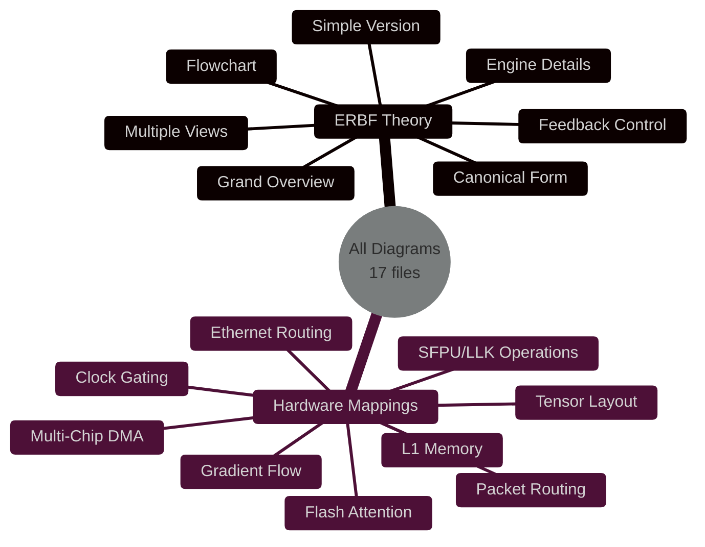
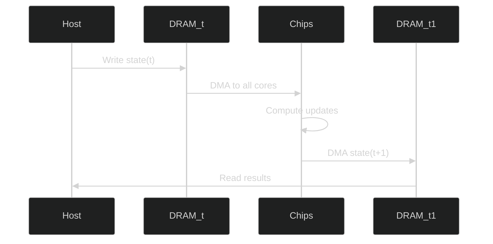
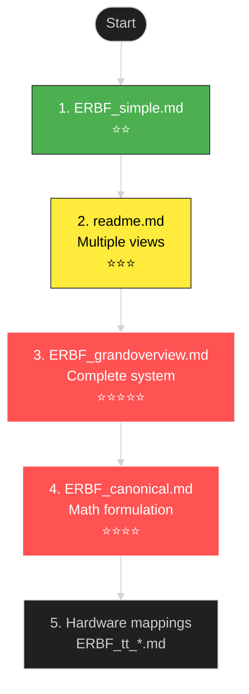
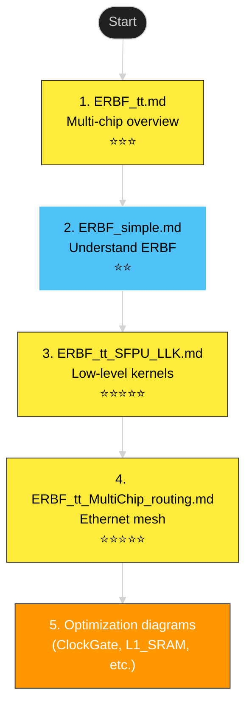
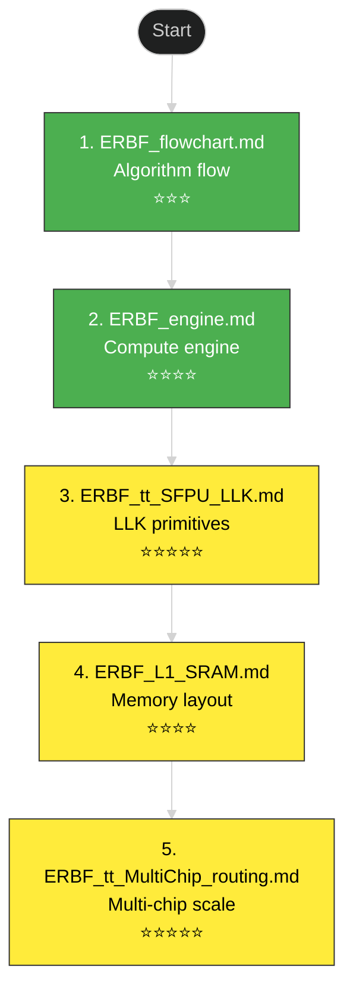
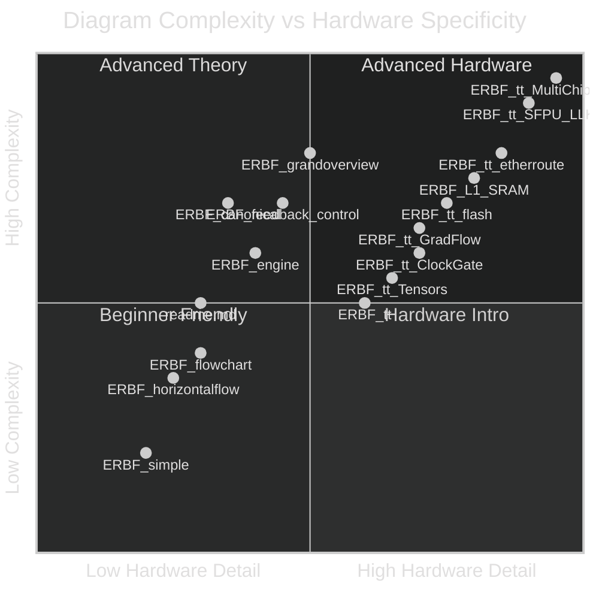

# Diagram Index and Navigation Guide

> Complete reference for all diagrams in this repository

## 📊 Diagram Overview

This repository contains **17 mermaid diagram files** organized into two main categories:

## 🧠 ERBF Theory Diagrams (`/diagrams/ERBF/`)

These diagrams explain the Evidence-based Relational Belief Feedback framework from a theoretical perspective.

### 1. readme.md - Multiple Visualization Styles

**Path**: `diagrams/ERBF/readme.md`

**Contains**: 5 different diagram types showing the same ERBF architecture

| Diagram Type | Purpose | Best For |
|--------------|---------|----------|
| Flowchart | Data flow between components | Understanding signal paths |
| Class Diagram | Object-oriented structure | Software implementation |
| State Diagram | Temporal evolution | Understanding cycles |
| Sequence Diagram | Step-by-step execution | Implementation details |
| Horizontal Flow | Philosophical view | Conceptual understanding |

**When to use**: Start here for a multi-perspective overview of ERBF

---

### 2. ERBF_grandoverview.md - Comprehensive Architecture

**Path**: `diagrams/ERBF/ERBF_grandoverview.md`

**Complexity**: ⭐⭐⭐⭐⭐ (Most comprehensive)

**Key Components Shown**:
- Relational Context injection
- Attention mechanism (Φ)
- Edge Gating (σ)
- Cortical Network nodes (V1, LM, n₃, n₄)
- Evidence Model (Ω)
- Belief formation (B(t+1))
- Objective function (KL minimization)

**Visual Style**: Detailed graph with styled subgraphs and connection labels

**When to use**: After understanding basics, for complete system view

---

### 3. ERBF_canonical.md - Mathematical Formulation

**Path**: `diagrams/ERBF/ERBF_canonical.md`

**Complexity**: ⭐⭐⭐⭐

**Focus**: Mathematical and computational aspects

**Key Elements**:
- Formal notation (Rel(t), Φ, σ, Ω)
- Update equations
- Recurrent architecture
- Probabilistic inference

**When to use**: For implementing ERBF computationally

---

### 4. ERBF_engine.md - Computational Engine

**Path**: `diagrams/ERBF/ERBF_engine.md`

**Complexity**: ⭐⭐⭐⭐

**Focus**: The computational machinery that drives ERBF

**Key Elements**:
- Processing pipeline
- Recurrent update mechanism
- State propagation
- Inference computation

**When to use**: Understanding the "how" of ERBF execution

---

### 5. ERBF_flowchart.md - Algorithmic Flow

**Path**: `diagrams/ERBF/ERBF_flowchart.md`

**Complexity**: ⭐⭐⭐

**Focus**: Step-by-step algorithm execution

**Key Elements**:
- Temporal sequence
- Decision points
- Loop structure
- Data dependencies

**When to use**: Implementing ERBF in code

---

### 6. ERBF_simple.md - Simplified Overview

**Path**: `diagrams/ERBF/ERBF_simple.md`

**Complexity**: ⭐⭐ (Most accessible)

**Focus**: Core concepts without complexity

**Key Elements**:
- Essential components only
- Clear signal flow
- Minimal notation
- Conceptual focus

**When to use**: First introduction to ERBF

---

### 7. ERBF_horizontalflow.md - Philosophical View

**Path**: `diagrams/ERBF/ERBF_horizontalflow.md`

**Complexity**: ⭐⭐⭐

**Focus**: Left-to-right information processing

**Key Elements**:
- Horizontal layout
- Descriptive labels
- Stage-by-stage flow
- Narrative structure

**When to use**: Explaining ERBF to non-technical audience

---

### 8. ERBF_feedback_control.md - Feedback Mechanisms

**Path**: `diagrams/ERBF/ERBF_feedback_control.md`

**Complexity**: ⭐⭐⭐⭐

**Focus**: Feedback loops and control flow

**Key Elements**:
- Feedback pathways
- Control mechanisms
- State transitions
- Loop dynamics

**When to use**: Understanding recurrent and feedback aspects

---

## ⚙️ Tenstorrent Hardware Mapping Diagrams

These diagrams show how ERBF operations map to Tenstorrent Grayskull hardware.

### 9. ERBF_tt.md - Multi-Chip DMA Architecture

**Path**: `diagrams/ERBF_tt.md`

**Hardware Focus**: Multi-chip communication via DRAM ring buffers

**Key Mappings**:
- Host CPU as Infer_Omega
- DRAM ring buffers for state (t) and (t+1)
- DMA transfers to/from Tensix cores
- Inter-chip 100GbE links

**Tenstorrent Elements**:
- Multiple chips (Chip-0, Chip-1)
- Tensix core grid
- DRAM interface
- Ethernet connectivity

**When to use**: Understanding multi-chip ERBF deployment

---

### 10. ERBF_tt_SFPU_LLK.md - Low-Level Kernel Operations

**Path**: `diagrams/ERBF_tt_SFPU_LLK.md`

**Hardware Focus**: Special Function Processing Unit and Low-Level Kernels

**Key Mappings**:
- Attention gate → `llk_sfpu_sigmoid_tile`
- Recurrent update → `llk_sfpu_matmul_tile` + `llk_sfpu_add_tiles`
- Belief E-step → `llk_sfpu_exp_tile` + `llk_sfpu_reduce_sum_row`

**Tenstorrent Elements**:
- L1 SRAM tiles (32×32)
- SFPU primitives
- Tile-based operations
- Memory-to-compute flow

**When to use**: Implementing ERBF kernels at lowest level

**Complexity**: ⭐⭐⭐⭐⭐ (Most technical)

---

### 11. ERBF_tt_MultiChip_routing.md - Ethernet Mesh Routing

**Path**: `diagrams/ERBF_tt_MultiChip_routing.md`

**Hardware Focus**: 2D chip mesh with Ethernet routing

**Key Mappings**:
- Cortical nodes (V1, LM, IT, PFC, PMC) → Chip locations (x,y)
- Relational edges → Ethernet links (E0-E15)
- State transfers → 100GbE packets
- Routing tables → Deterministic packet delivery

**Tenstorrent Elements**:
- 2D chip mesh topology
- Ethernet tiles per chip
- NoC routing
- PCIe host connection

**Scale**: Up to 6 chips shown (extendable)

**When to use**: Designing large-scale ERBF deployments

**Complexity**: ⭐⭐⭐⭐⭐

---

### 12. ERBF_tt_Tensors.md - Tensor Layout and Tiling

**Path**: `diagrams/ERBF_tt_Tensors.md`

**Hardware Focus**: How ERBF tensors map to hardware tiles

**Key Mappings**:
- Belief tensors → 32×32 FP16 tiles
- Attention matrices → Tiled matmuls
- State vectors → L1 SRAM layout

**When to use**: Optimizing memory access patterns

---

### 13. ERBF_tt_GradFlow.md - Gradient Flow Architecture

**Path**: `diagrams/ERBF_tt_GradFlow.md`

**Hardware Focus**: Backpropagation through NoC

**Key Mappings**:
- Forward pass → NoC packets (one direction)
- Backward pass → NoC packets (reverse direction)
- Gradient accumulation → Local SRAM

**When to use**: Training ERBF models on hardware

---

### 14. ERBF_tt_ClockGate.md - Power Management

**Path**: `diagrams/ERBF_tt_ClockGate.md`

**Hardware Focus**: Power-efficient clock gating

**Key Mappings**:
- Inactive ERBF nodes → Clock-gated Tensix cores
- Attention-based gating → Hardware clock enable
- Dynamic power scaling

**When to use**: Optimizing power consumption

---

### 15. ERBF_tt_flash.md - Flash Attention Implementation

**Path**: `diagrams/ERBF_tt_flash.md`

**Hardware Focus**: Memory-efficient attention

**Key Mappings**:
- Flash attention blocks → Tiled computation
- Reduced memory footprint → L1 SRAM optimization
- Recomputation strategy

**When to use**: Implementing attention efficiently

---

### 16. ERBF_tt_etherroute.md - Ethernet Packet Routing

**Path**: `diagrams/ERBF_tt_etherroute.md`

**Hardware Focus**: Detailed packet routing mechanism

**Key Mappings**:
- ERBF messages → Ethernet packets
- Routing tables → Hardware lookup
- Flow control

**When to use**: Low-level network debugging

---

### 17. ERBF_L1_SRAM.md - L1 Memory Hierarchy

**Path**: `diagrams/ERBF_L1_SRAM.md`

**Hardware Focus**: Local memory management

**Key Mappings**:
- ERBF state tiles → L1 SRAM layout
- Memory allocation strategy
- Bank conflicts avoidance

**When to use**: Optimizing memory bandwidth

---

## 🎯 Learning Paths

### Path 1: Theory-First (Recommended for Researchers)

### Path 2: Hardware-First (Recommended for Engineers)

### Path 3: Implementation-Focused (Recommended for Developers)

## 🔍 Finding Diagrams by Topic

### Attention Mechanisms
- `diagrams/ERBF/ERBF_canonical.md` - Mathematical definition of Φ
- `diagrams/ERBF/ERBF_engine.md` - Attention engine implementation
- `diagrams/ERBF_tt_flash.md` - Flash attention on hardware

### Multi-Chip Scaling
- `diagrams/ERBF_tt.md` - DMA-based multi-chip
- `diagrams/ERBF_tt_MultiChip_routing.md` - Ethernet mesh routing
- `diagrams/ERBF_tt_etherroute.md` - Packet routing details

### Memory Management
- `diagrams/ERBF_L1_SRAM.md` - L1 SRAM tile layout
- `diagrams/ERBF_tt_Tensors.md` - Tensor tiling strategies

### Performance Optimization
- `diagrams/ERBF_tt_ClockGate.md` - Power efficiency
- `diagrams/ERBF_tt_flash.md` - Memory-efficient attention
- `diagrams/ERBF_tt_GradFlow.md` - Efficient backpropagation

### Low-Level Implementation
- `diagrams/ERBF_tt_SFPU_LLK.md` - Kernel primitives
- `diagrams/ERBF_tt_etherroute.md` - Network layer
- `diagrams/ERBF_L1_SRAM.md` - Memory access

## 📈 Diagram Complexity Matrix

## 🎨 Diagram Visual Styles

All diagrams use **dark theme** for better readability. Common style patterns:

| Color | Meaning | Used For |
|-------|---------|----------|
| 🔵 Blue (`#4fc3f7`) | Input/Context | Relational context, external stimulus |
| 🟡 Yellow (`#ffeb3b`) | Hardware | Tensix cores, SFPU operations |
| 🟢 Green (`#c8e6c9`) | ERBF Logic | Cognitive components, ERBF nodes |
| 🟠 Orange (`#ff9800`) | Network | Ethernet links, routing |
| 🔴 Red (`#ff5252`) | Issues | Problems, warnings |
| ⚪ Grey (`#9e9e9e`) | Memory | DRAM, SRAM, storage |

## 📝 Diagram Metadata

| Category | Count | Average Complexity | Total Lines |
|----------|-------|-------------------|-------------|
| ERBF Theory | 8 | ⭐⭐⭐ | ~1000 |
| Hardware Mappings | 9 | ⭐⭐⭐⭐ | ~1400 |
| **Total** | **17** | **⭐⭐⭐½** | **~2400** |

## 🔗 Quick Links

### Theory Documentation
- [ERBF Theory Overview](diagrams/ERBF/readme.md)
- [Complete Architecture](diagrams/ERBF/ERBF_grandoverview.md)
- [Simple Introduction](diagrams/ERBF/ERBF_simple.md)

### Hardware Documentation
- [Multi-Chip Architecture](diagrams/ERBF_tt.md)
- [Low-Level Kernels](diagrams/ERBF_tt_SFPU_LLK.md)
- [Ethernet Mesh](diagrams/ERBF_tt_MultiChip_routing.md)

### Tools
- [Diagnostic Tool](diagnostics/readme.md)
- [Main README](README.md)

---

**Navigation Tip**: Use your browser's search (Ctrl+F / Cmd+F) to find specific topics in this index.
