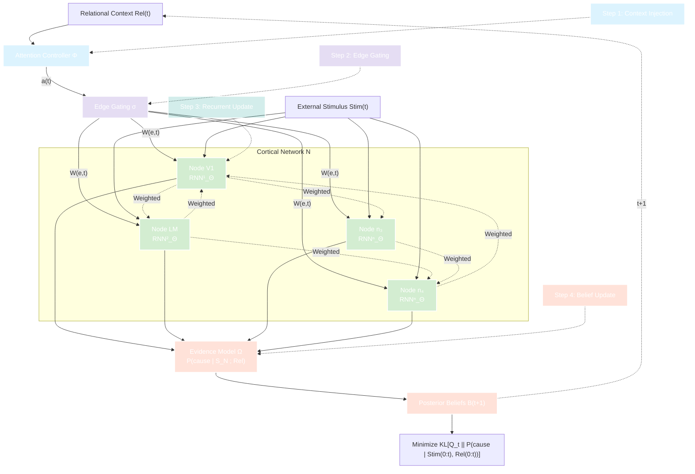

```mermaid
graph TD
    %% Input Sources - Light labels on dark
    Rel["Relational Context Rel(t)"]
    Stim["External Stimulus Stim(t)"]
    
    %% System Components
    Attn["Attention Controller Φ"]
    Gate["Edge Gating σ"]
    
    %% Cortical Nodes
    subgraph Cortical["Cortical Network N"]
        V1["Node V1<br/>RNN¹_Θ"]
        LM["Node LM<br/>RNN²_Θ"]
        N3["Node n₃<br/>RNNⁿ_Θ"]
        N4["Node n₄<br/>RNNⁿ_Θ"]
    end
    
    %% Evidence Model
    Omega["Evidence Model Ω<br/>P(cause | S_N ; Rel)"]
    
    %% Outputs
    Post["Posterior Beliefs B(t+1)"]
    
    %% Objective
    Obj["Minimize KL[Q_t || P(cause | Stim(0:t), Rel(0:t))]"]

    %% Time step flow
    Rel --> Attn
    Attn -->|"a(t)"| Gate
    Gate -->|"W(e,t)"| V1
    Gate -->|"W(e,t)"| LM
    Gate -->|"W(e,t)"| N3
    Gate -->|"W(e,t)"| N4
    
    %% External stimulus to all nodes
    Stim --> V1
    Stim --> LM
    Stim --> N3
    Stim --> N4
    
    %% Inter-node connections (gated)
    V1 -. "Weighted" .-> LM
    V1 -. "Weighted" .-> N3
    LM -. "Weighted" .-> V1
    LM -. "Weighted" .-> N4
    N3 -. "Weighted" .-> N4
    N4 -. "Weighted" .-> V1
    
    %% State to evidence model
    V1 --> Omega
    LM --> Omega
    N3 --> Omega
    N4 --> Omega
    
    %% Final output
    Omega --> Post
    
    %% Feedback loop (implicit)
    Post -. "t+1" .-> Rel
    
    %% Objective annotation
    Post --> Obj

    %% Step annotations - Light, readable colors
    classDef step1 fill:#4fc3f7,stroke:#ffffff,stroke-width:2px,color:#ffffff,fill-opacity:0.2;
    classDef step2 fill:#7e57c2,stroke:#ffffff,stroke-width:2px,color:#ffffff,fill-opacity:0.2;
    classDef step3 fill:#26a69a,stroke:#ffffff,stroke-width:2px,color:#ffffff,fill-opacity:0.2;
    classDef step4 fill:#ff7043,stroke:#ffffff,stroke-width:2px,color:#ffffff,fill-opacity:0.2;

    class Attn step1
    class Gate step2
    class V1,LM,N3,N4 step3
    class Omega,Post step4
    
    %% Step labels with visibility
    Step1["Step 1: Context Injection"]:::step1
    Step2["Step 2: Edge Gating"]:::step2 
    Step3["Step 3: Recurrent Update"]:::step3
    Step4["Step 4: Belief Update"]:::step4

    %% Optional: connect steps to components
    Step1 -.-> Attn
    Step2 -.-> Gate
    Step3 -.-> V1
    Step4 -.-> Omega
```
