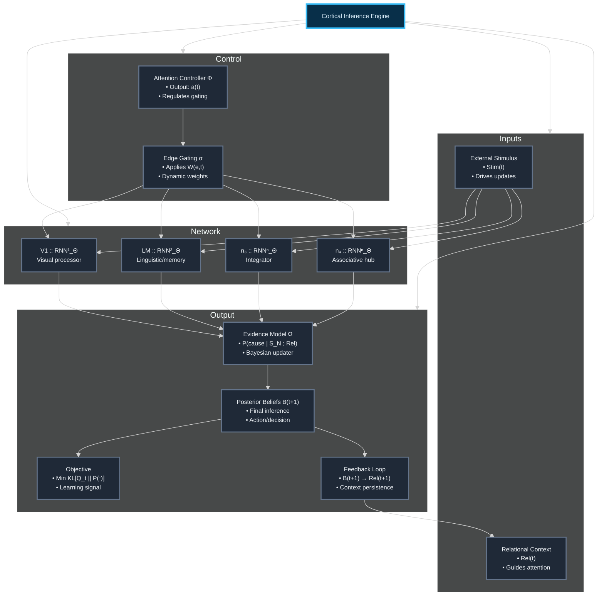

```mermaid
%%{init: {'theme': 'dark'}}%%
flowchart TD
    %% Main Engine Node
    C["Cortical Inference Engine"]

    %% Subgraphs for each logical section
    subgraph Inputs
        I1["Relational Context<br/>• Rel(t)<br/>• Guides attention"]
        I2["External Stimulus<br/>• Stim(t)<br/>• Drives updates"]
    end

    subgraph Control
        A["Attention Controller Φ<br/>• Output: a(t)<br/>• Regulates gating"]
        G["Edge Gating σ<br/>• Applies W(e,t)<br/>• Dynamic weights"]
    end

    subgraph Network
        N1["V1 :: RNN¹_Θ<br/>Visual processor"]
        N2["LM :: RNN²_Θ<br/>Linguistic/memory"]
        N3["n₃ :: RNNⁿ_Θ<br/>Integrator"]
        N4["n₄ :: RNNⁿ_Θ<br/>Associative hub"]
    end

    subgraph Output
        O1["Evidence Model Ω<br/>• P(cause | S_N ; Rel)<br/>• Bayesian updater"]
        O2["Posterior Beliefs B(t+1)<br/>• Final inference<br/>• Action/decision"]
        O3["Objective<br/>• Min KL[Q_t || P(⋅)]<br/>• Learning signal"]
        O4["Feedback Loop<br/>• B(t+1) → Rel(t+1)<br/>• Context persistence"]
    end

    %% Define top-level connections
    C --> Inputs
    C --> Control
    C --> Network
    C --> Output

    %% Define detailed connections
    A --> G
    G --> N1 & N2 & N3 & N4
    I2 --> N1 & N2 & N3 & N4
    N1 & N2 & N3 & N4 --> O1
    O1 --> O2
    O2 --> O3
    O2 --> O4
    O4 --> I1

    %% Define high-contrast styles for dark mode
    classDef default fill:#1f2937,stroke:#64748b,stroke-width:2px,color:#f1f5f9,font-size:12px;
    classDef highlight fill:#082f49,stroke:#38bdf8,stroke-width:3px,color:#e0f2fe;

    %% Apply styles to nodes
    class C highlight
    class I1,I2,A,G,N1,N2,N3,N4,O1,O2,O3,O4 default
```
