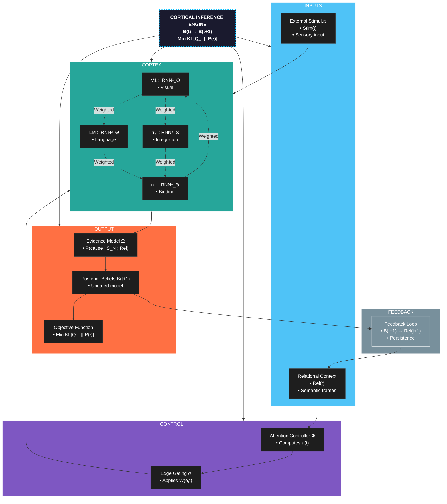

```mermaid
%%{init: {
  'theme': 'dark',
  'themeVariables': {
    'primaryColor': '#0f0f1b',
    'textColor': '#ffffff',
    'lineColor': '#444466',
    'borderColor': '#333355',
    'arrowMarkerColor': '#ffffff'
  }
}}}%%

flowchart TD
    %% Central Core
    CORE["CORTICAL INFERENCE ENGINE\nB(t) → B(t+1)\nMin KL[Q_t || P(⋅)]"]
    style CORE fill:#1a1a2e,stroke:#00bfff,stroke-width:3px,stroke-dasharray:4,color:#fff,font-weight:bold

    %% Input Realm
    subgraph INPUTS
        direction TB
        REL["Relational Context\n• Rel(t)\n• Semantic frames"]
        STIM["External Stimulus\n• Stim(t)\n• Sensory input"]
    end

    %% Control Nexus
    subgraph CONTROL
        direction TB
        ATTN["Attention Controller Φ\n• Computes a(t)"]
        GATE["Edge Gating σ\n• Applies W(e,t)"]
    end

    %% Cortical Network
    subgraph CORTEX
        direction TB
        V1["V1 :: RNN¹_Θ\n• Visual"]
        LM["LM :: RNN²_Θ\n• Language"]
        N3["n₃ :: RNNⁿ_Θ\n• Integration"]
        N4["n₄ :: RNNⁿ_Θ\n• Binding"]

        V1 -. "Weighted" .-> LM
        LM -. "Weighted" .-> N4
        V1 -. "Weighted" .-> N3
        N3 -. "Weighted" .-> N4
        N4 -. "Weighted" .-> V1
    end

    %% Output Sphere
    subgraph OUTPUT
        direction TB
        OMEGA["Evidence Model Ω\n• P(cause | S_N ; Rel)"]
        POST["Posterior Beliefs B(t+1)\n• Updated model"]
        OBJ["Objective Function\n• Min KL[Q_t || P(⋅)]"]
    end

    %% Feedback Loop
    subgraph FEEDBACK
        direction TB
        FB["Feedback Loop\n• B(t+1) → Rel(t+1)\n• Persistence"]
    end

    %% Connections
    REL --> ATTN
    ATTN --> GATE
    GATE --> CORTEX
    STIM --> CORTEX
    CORTEX --> OMEGA
    OMEGA --> POST
    POST --> OBJ
    POST --> FB
    FB --> REL

    CORE --> INPUTS
    CORE --> CONTROL
    CORE --> CORTEX
    CORE --> OUTPUT

    %% Styling
    classDef default fill:#1e1e1e,stroke:#444,color:#fff
    classDef input fill:#4fc3f7,stroke:#fff,color:#fff
    classDef control fill:#7e57c2,stroke:#fff,color:#fff
    classDef cortex fill:#26a69a,stroke:#fff,color:#fff
    classDef output fill:#ff7043,stroke:#fff,color:#fff
    classDef feedback fill:#78909c,stroke:#fff,color:#fff

    class INPUTS input
    class CONTROL control
    class CORTEX cortex
    class OUTPUT output
    class FEEDBACK feedback
    class FB feedback
```
