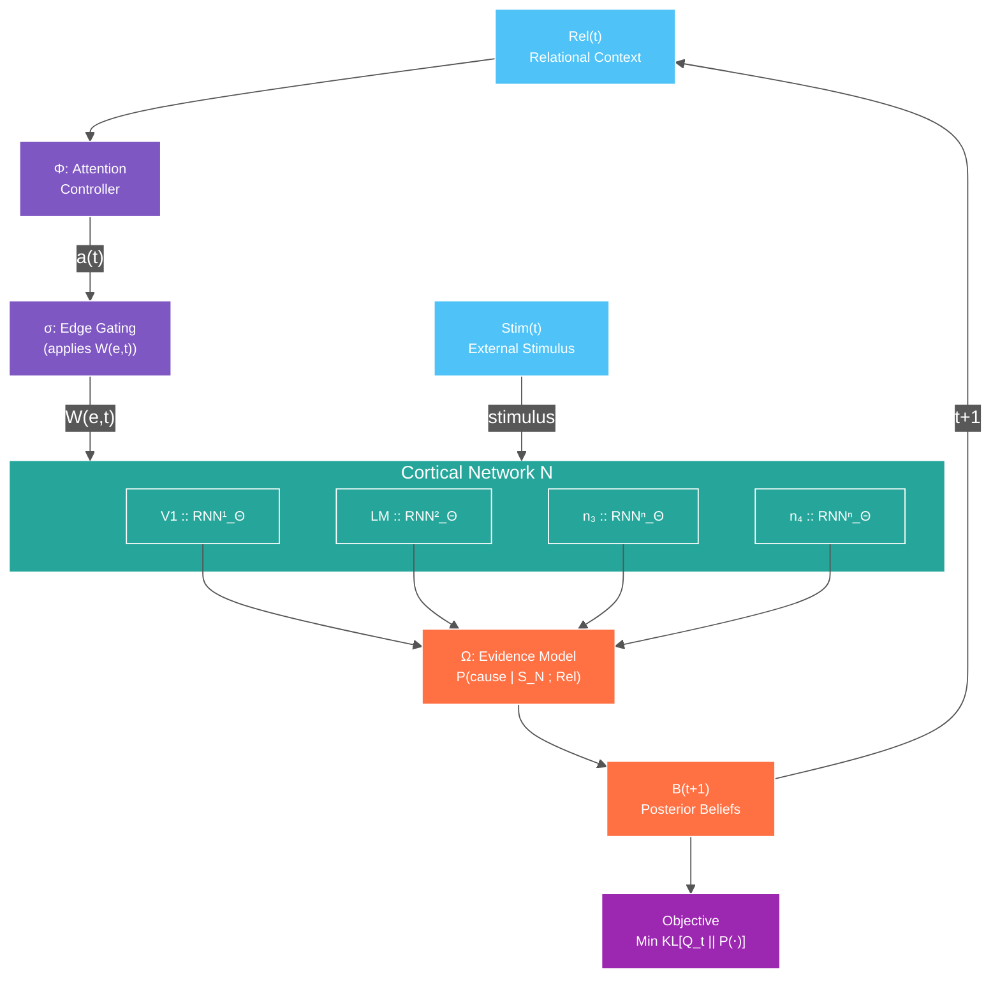

```mermaid
%%{init: {'theme': 'dark', 'themeVariables': {
  'primaryColor': '#1e1e1e',
  'textColor': '#ffffff',
  'lineColor': '#555',
  'borderColor': '#444',
  'arrowMarkerColor': '#ffffff'
}}}%%

flowchart TD
    %% Inputs
    Rel["Rel(t)\nRelational Context"] 
    Stim["Stim(t)\nExternal Stimulus"]

    %% Controllers
    Attn["Φ: Attention\nController"]
    Gate["σ: Edge Gating\n(applies W(e,t))"]

    %% Cortical Network (as a module)
    subgraph Cortical["Cortical Network N"]
        V1["V1 :: RNN¹_Θ"]
        LM["LM :: RNN²_Θ"]
        N3["n₃ :: RNNⁿ_Θ"]
        N4["n₄ :: RNNⁿ_Θ"]
    end

    %% Outputs
    Omega["Ω: Evidence Model\nP(cause | S_N ; Rel)"]
    Post["B(t+1)\nPosterior Beliefs"]
    Obj["Objective\nMin KL[Q_t || P(⋅)]"]

    %% Connections
    Rel --> Attn
    Attn -->|"a(t)"| Gate
    Gate -->|"W(e,t)"| Cortical
    Stim -->|"stimulus"| Cortical

    V1 --> Omega
    LM --> Omega
    N3 --> Omega
    N4 --> Omega

    Omega --> Post
    Post --> Obj
    Post -->|"t+1"| Rel

    %% Styling
    classDef default fill:#1e1e1e,stroke:#444,color:#fff,font-size:12px;
    classDef input fill:#4fc3f7,stroke:#fff,color:#fff;
    classDef control fill:#7e57c2,stroke:#fff,color:#fff;
    classDef network fill:#26a69a,stroke:#fff,color:#fff;
    classDef output fill:#ff7043,stroke:#fff,color:#fff;
    classDef objective fill:#9c27b0,stroke:#fff,color:#fff;

    class Rel,Stim input
    class Attn,Gate control
    class Cortical,V1,LM,N3,N4 network
    class Omega,Post output
    class Obj objective
```
