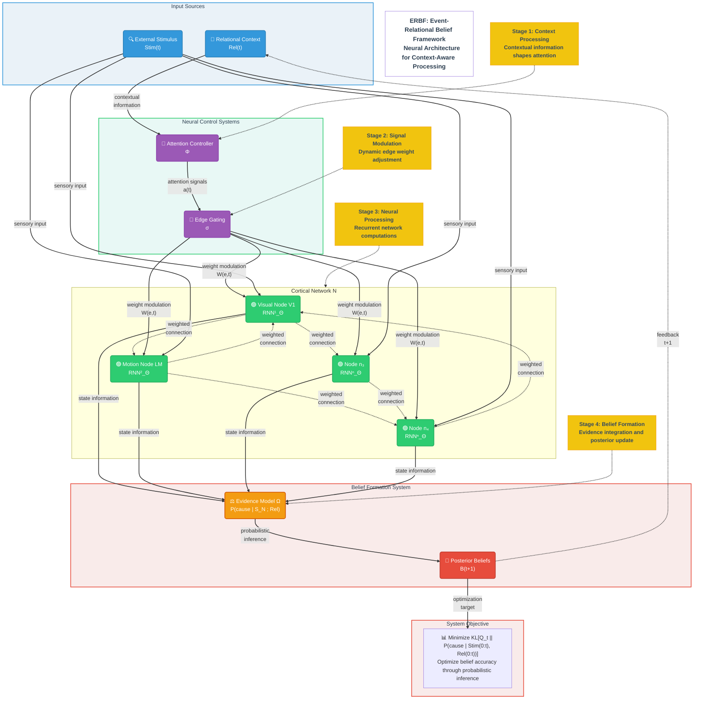

```mermaid
flowchart TD
    %% Main Components with Custom Styling
    classDef inputNode fill:#3498db,color:#fff,stroke:#2980b9,stroke-width:2px,border-radius:15px
    classDef controlNode fill:#9b59b6,color:#fff,stroke:#8e44ad,stroke-width:2px,border-radius:15px
    classDef corticalNode fill:#2ecc71,color:#fff,stroke:#27ae60,stroke-width:2px,border-radius:8px
    classDef outputNode fill:#e74c3c,color:#fff,stroke:#c0392b,stroke-width:2px,border-radius:15px
    classDef modelNode fill:#f39c12,color:#fff,stroke:#d35400,stroke-width:2px,border-radius:12px
    
    %% Background Styling for Subgraphs
    classDef inputBg fill:#eaf2f8,stroke:#3498db,stroke-width:2px,color:#2c3e50
    classDef processingBg fill:#e8f8f5,stroke:#2ecc71,stroke-width:2px,color:#2c3e50
    classDef outputBg fill:#f9ebea,stroke:#e74c3c,stroke-width:2px,color:#2c3e50
    
    %% Arrow Styling
    linkStyle default stroke-width:2px

    %% Title and System Overview
    title["ERBF: Event-Relational Belief Framework
    Neural Architecture for Context-Aware Processing"]
    title:::title
    
    %% Input Nodes
    subgraph InputSources ["Input Sources"]
        direction LR
        Rel("🔄 Relational Context<br/>Rel(t)")
        Stim("🔍 External Stimulus<br/>Stim(t)")
    end
    
    %% Control Mechanisms
    subgraph ControlMechanisms ["Neural Control Systems"]
        direction LR
        Attn("🧠 Attention Controller<br/>Φ")
        Gate("🚪 Edge Gating<br/>σ")
    end
    
    %% Cortical Network
    subgraph CorticalNetwork ["Cortical Network N"]
        direction TB
        V1("🟢 Visual Node V1<br/>RNN¹_Θ")
        LM("🟢 Motion Node LM<br/>RNN²_Θ")
        N3("🟢 Node n₃<br/>RNNⁿ_Θ")
        N4("🟢 Node n₄<br/>RNNⁿ_Θ")
        
        %% Inter-node connections (within subgraph)
        V1 -. "weighted<br/>connection" .-> LM
        V1 -. "weighted<br/>connection" .-> N3
        LM -. "weighted<br/>connection" .-> V1
        LM -. "weighted<br/>connection" .-> N4
        N3 -. "weighted<br/>connection" .-> N4
        N4 -. "weighted<br/>connection" .-> V1
    end
    
    %% Evidence and Output
    subgraph BeliefSystem ["Belief Formation System"]
        Omega("⚖️ Evidence Model Ω<br/>P(cause | S_N ; Rel)")
        Post("🧩 Posterior Beliefs<br/>B(t+1)")
    end
    
    %% Connections between components
    Rel -- "contextual<br/>information" --> Attn
    Attn -- "attention signals<br/>a(t)" --> Gate
    Gate -- "weight modulation<br/>W(e,t)" --> V1
    Gate -- "weight modulation<br/>W(e,t)" --> LM
    Gate -- "weight modulation<br/>W(e,t)" --> N3
    Gate -- "weight modulation<br/>W(e,t)" --> N4
    
    Stim -- "sensory input" --> V1
    Stim -- "sensory input" --> LM
    Stim -- "sensory input" --> N3
    Stim -- "sensory input" --> N4
    
    V1 -- "state information" --> Omega
    LM -- "state information" --> Omega
    N3 -- "state information" --> Omega
    N4 -- "state information" --> Omega
    
    Omega -- "probabilistic<br/>inference" --> Post
    
    %% Feedback loop
    Post -. "feedback<br/>t+1" .-> Rel
    
    %% Objective
    subgraph Objective ["System Objective"]
        Obj["📊 Minimize KL[Q_t || P(cause | Stim(0:t), Rel(0:t))]<br/>Optimize belief accuracy through probabilistic inference"]
    end
    
    Post -- "optimization<br/>target" --> Obj
    
    %% Processing Stages
    Stage1["Stage 1: Context Processing<br/>Contextual information shapes attention"]
    Stage2["Stage 2: Signal Modulation<br/>Dynamic edge weight adjustment"]
    Stage3["Stage 3: Neural Processing<br/>Recurrent network computations"]
    Stage4["Stage 4: Belief Formation<br/>Evidence integration and posterior update"]
    
    %% Apply classes
    class Rel,Stim inputNode
    class Attn,Gate controlNode
    class V1,LM,N3,N4 corticalNode
    class Omega modelNode
    class Post outputNode
    class InputSources inputBg
    class ControlMechanisms,CorticalNetwork processingBg
    class BeliefSystem,Objective outputBg
    
    %% Styling for stages
    classDef stageLabel fill:#f1c40f,color:#34495e,stroke:#f39c12,stroke-width:1px,font-weight:bold
    class Stage1,Stage2,Stage3,Stage4 stageLabel
    
    %% Styling for title
    classDef title fill:none,color:#2c3e50,font-size:18px,font-weight:bold
    
    %% Connect stages to components
    Stage1 -.-> Attn
    Stage2 -.-> Gate
    Stage3 -.-> CorticalNetwork
    Stage4 -.-> Omega
```
