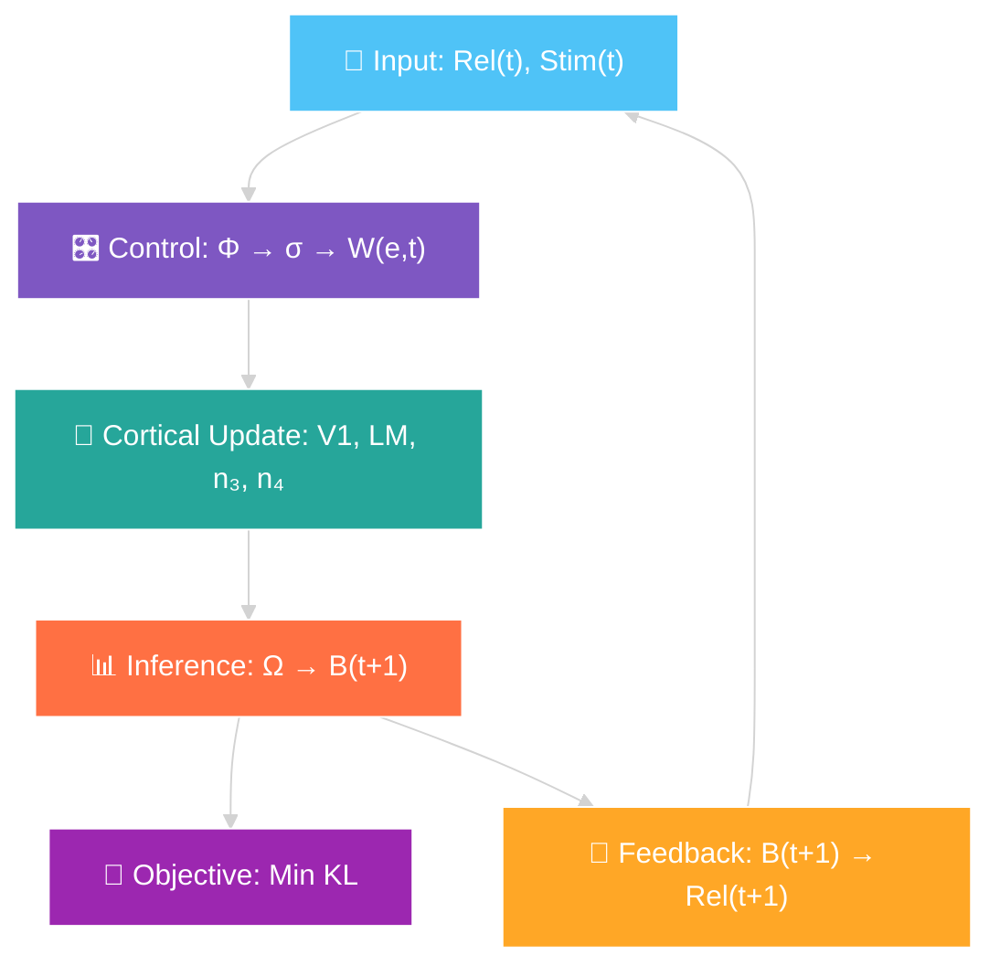

```mermaid
%%{init: {'theme': 'dark'}}%%
flowchart TD
    A["🧠 Input: Rel(t), Stim(t)"]
    B["🎛️ Control: Φ → σ → W(e,t)"]
    C["🔁 Cortical Update: V1, LM, n₃, n₄"]
    D["📊 Inference: Ω → B(t+1)"]
    E["🎯 Objective: Min KL"]
    F["🔄 Feedback: B(t+1) → Rel(t+1)"]

    A --> B
    B --> C
    C --> D
    D --> E
    D --> F
    F --> A

    style A fill:#4fc3f7,stroke:#fff,color:#fff
    style B fill:#7e57c2,stroke:#fff,color:#fff
    style C fill:#26a69a,stroke:#fff,color:#fff
    style D fill:#ff7043,stroke:#fff,color:#fff
    style E fill:#9c27b0,stroke:#fff,color:#fff
    style F fill:#ffa726,stroke:#fff,color:#fff

    click A callback "Input Layer"
    click D callback "Belief Update"
```
