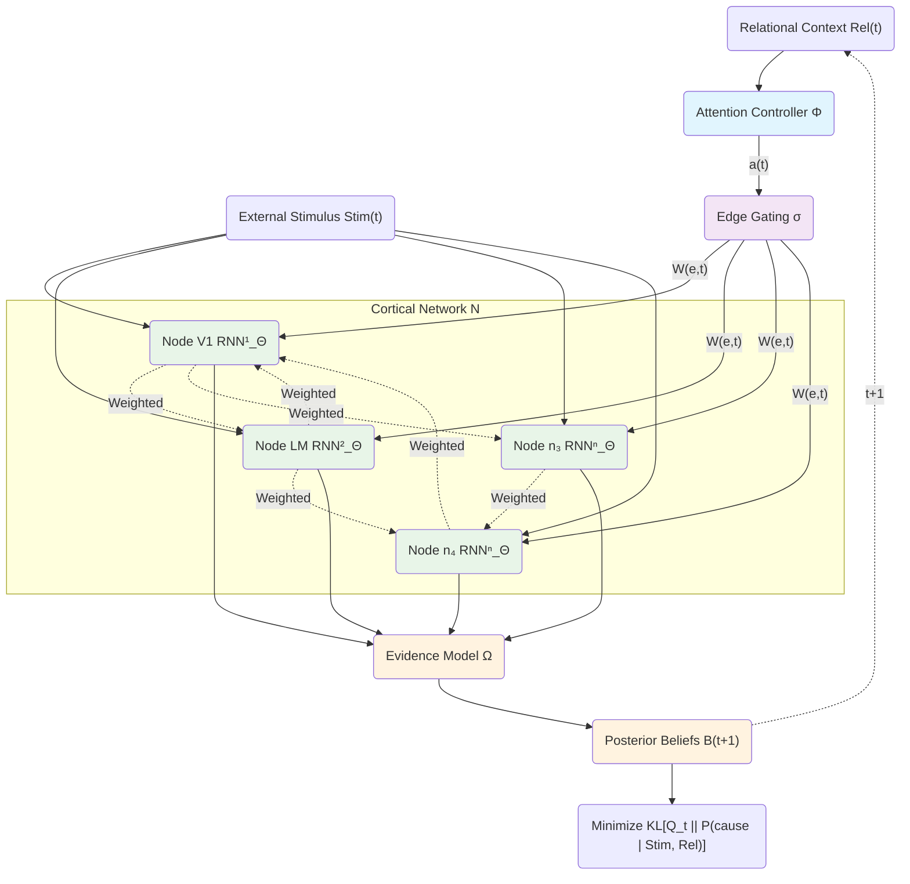

```mermaid
flowchart TD
    Rel("Relational Context Rel(t)") --> Attn("Attention Controller Φ")
    Stim("External Stimulus Stim(t)") --> V1
    Stim --> LM
    Stim --> N3
    Stim --> N4
    
    Attn -- "a(t)" --> Gate("Edge Gating σ")
    Gate -- "W(e,t)" --> V1("Node V1 RNN¹_Θ")
    Gate -- "W(e,t)" --> LM("Node LM RNN²_Θ")
    Gate -- "W(e,t)" --> N3("Node n₃ RNNⁿ_Θ")
    Gate -- "W(e,t)" --> N4("Node n₄ RNNⁿ_Θ")
    
    V1 -. "Weighted" .-> LM
    V1 -. "Weighted" .-> N3
    LM -. "Weighted" .-> V1
    LM -. "Weighted" .-> N4
    N3 -. "Weighted" .-> N4
    N4 -. "Weighted" .-> V1
    
    V1 --> Omega("Evidence Model Ω")
    LM --> Omega
    N3 --> Omega
    N4 --> Omega
    
    Omega --> Post("Posterior Beliefs B(t+1)")
    Post --> Obj("Minimize KL[Q_t || P(cause | Stim, Rel)]")
    Post -. "t+1" .-> Rel
    
    subgraph Cortical["Cortical Network N"]
        V1
        LM
        N3
        N4
    end
    
    classDef step1 fill:#e1f5fe
    classDef step2 fill:#f3e5f5
    classDef step3 fill:#e8f5e8
    classDef step4 fill:#fff3e0
    
    class Attn step1
    class Gate step2
    class V1,LM,N3,N4 step3
    class Omega,Post step4
```
