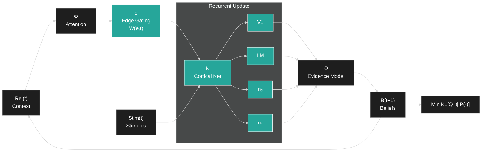
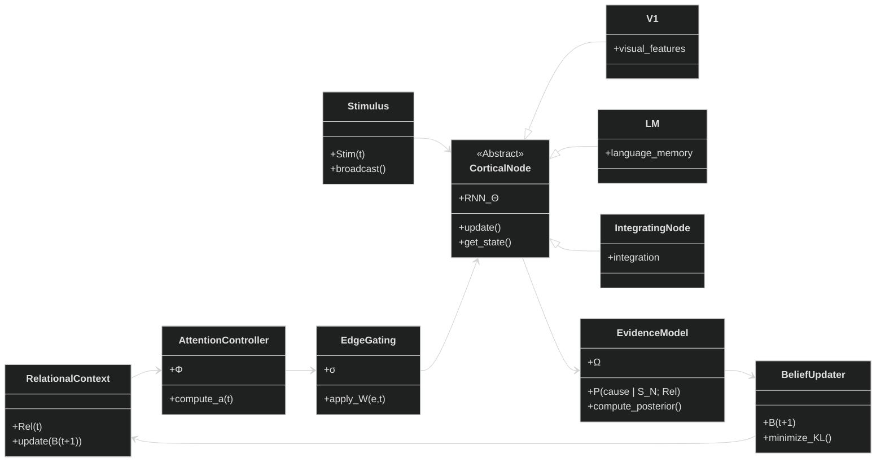
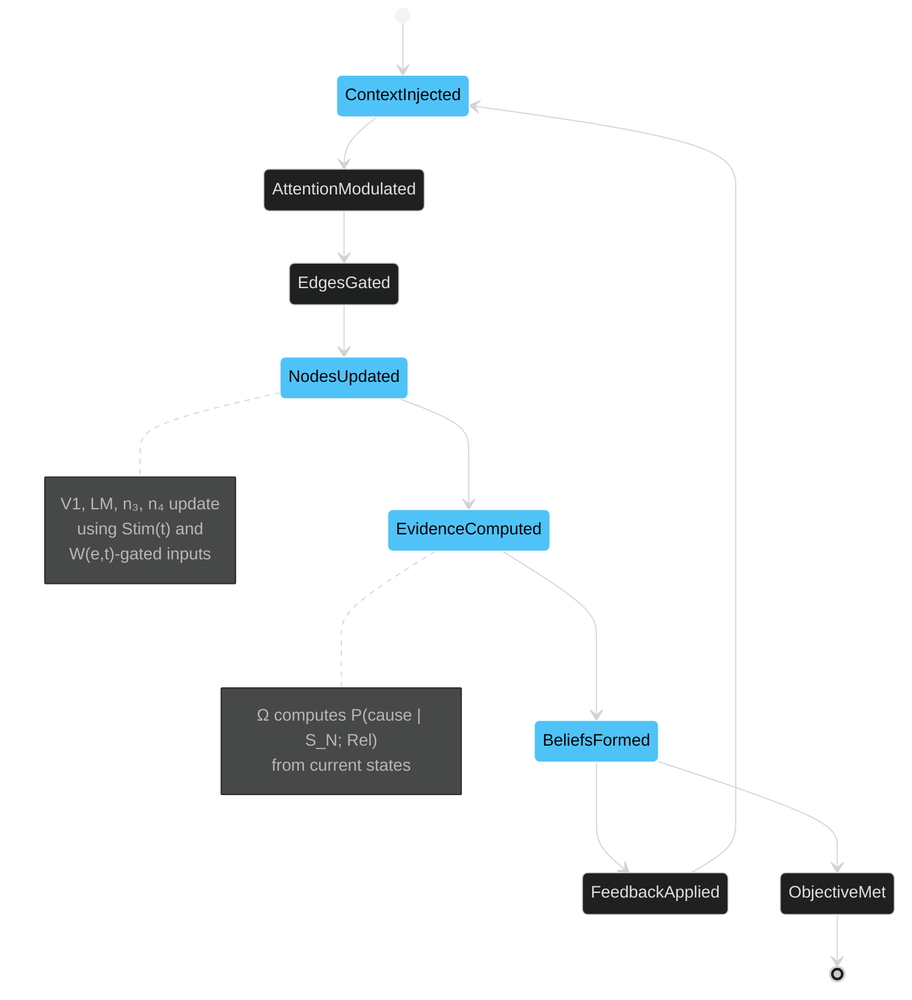
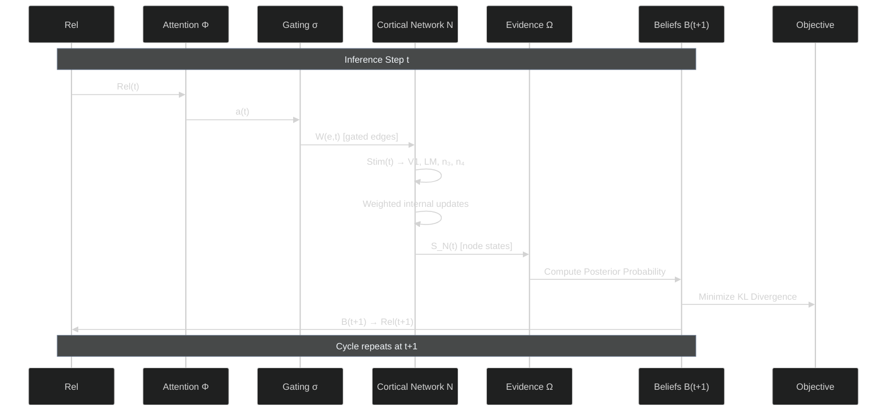

```mermaid
%%{init: {'theme': 'dark'}}%%
flowchart LR
    Rel["Rel(t)\nContext"] --> Attn["Φ\nAttention"]
    Attn --> Gate["σ\nEdge Gating\nW(e,t)"]
    Gate --> N["N\nCortical Net"]
    Stim["Stim(t)\nStimulus"] --> N

    subgraph Update["Recurrent Update"]
        N --> V1["V1"]
        N --> LM["LM"]
        N --> n3["n₃"]
        N --> n4["n₄"]
    end

    V1 --> Omega["Ω\nEvidence Model"]
    LM --> Omega
    n3 --> Omega
    n4 --> Omega

    Omega --> Post["B(t+1)\nBeliefs"]
    Post --> Obj["Min KL[Q_t||P(⋅)]"]
    Post --> Rel

    classDef box fill:#1e1e1e,stroke:#555,color:#fff;
    classDef comp fill:#26a69a,stroke:#fff,color:#fff;
    class Rel,Stim,Attn,Post,Obj,Omega box
    class Gate,N,V1,LM,n3,n4 comp
```

```mermaid
%%{init: {'theme': 'dark'}}%%
classDiagram
    direction LR

    class RelationalContext {
      +Rel(t)
      +update(B(t+1))
    }
    class Stimulus {
      +Stim(t)
      +broadcast()
    }
    class AttentionController {
      +Φ
      +compute_a(t)
    }
    class EdgeGating {
      +σ
      +apply_W(e,t)
    }
    class CorticalNode {
      <<Abstract>>
      +RNN_Θ
      +update()
      +get_state()
    }
    class V1 {
      +visual_features
    }
    class LM {
      +language_memory
    }
    class IntegratingNode {
      +integration
    }
    class EvidenceModel {
      +Ω
      +P(cause | S_N; Rel)
      +compute_posterior()
    }
    class BeliefUpdater {
      +B(t+1)
      +minimize_KL()
    }

    RelationalContext --> AttentionController
    Stimulus --> CorticalNode
    AttentionController --> EdgeGating
    EdgeGating --> CorticalNode
    CorticalNode <|-- V1
    CorticalNode <|-- LM
    CorticalNode <|-- IntegratingNode
    CorticalNode --> EvidenceModel
    EvidenceModel --> BeliefUpdater
    BeliefUpdater --> RelationalContext
```

```mermaid
%%{init: {'theme': 'dark'}}%%
stateDiagram-v2
    [*] --> ContextInjected
    ContextInjected --> AttentionModulated
    AttentionModulated --> EdgesGated
    EdgesGated --> NodesUpdated
    NodesUpdated --> EvidenceComputed
    EvidenceComputed --> BeliefsFormed
    BeliefsFormed --> FeedbackApplied
    FeedbackApplied --> ContextInjected

    note right of NodesUpdated
        V1, LM, n₃, n₄ update
        using Stim(t) and
        W(e,t)-gated inputs
    end note

    note right of EvidenceComputed
        Ω computes P(cause | S_N; Rel)
        from current states
    end note

    BeliefsFormed --> ObjectiveMet
    ObjectiveMet --> [*]

    %% Correct styling syntax for state diagrams
    style ContextInjected fill:#4fc3f7,stroke:#fff,color:#000
    style NodesUpdated fill:#4fc3f7,stroke:#fff,color:#000
    style EvidenceComputed fill:#4fc3f7,stroke:#fff,color:#000
    style BeliefsFormed fill:#4fc3f7,stroke:#fff,color:#000
```

```mermaid
%%{init: {'theme': 'dark', 'themeVariables': {
  'actorBgColor': '#1f2937',
  'actorBorderColor': '#38bdf8',
  'textColor': '#f1f5f9',
  'noteBorderColor': '#64748b',
  'noteTextColor': '#f1f5f9',
  'messageColor': '#f1f5f9'
}}}%%
sequenceDiagram
    participant Rel
    participant Attn as Attention Φ
    participant Gate as Gating σ
    participant N as Cortical Network N
    participant Omega as Evidence Ω
    participant Post as Beliefs B(t+1)
    participant Obj as Objective

    Note over Rel,Post: Inference Step t

    Rel->>Attn: Rel(t)
    Attn->>Gate: a(t)
    Gate->>N: W(e,t) [gated edges]
    N->>N: Stim(t) → V1, LM, n₃, n₄
    N->>N: Weighted internal updates
    N->>Omega: S_N(t) [node states]
    
    %% SIMPLIFIED LINE TO AVOID PARSER BUG
    Omega->>Post: Compute Posterior Probability
    
    %% SIMPLIFIED LINE TO AVOID PARSER BUG
    Post->>Obj: Minimize KL Divergence
    
    Post->>Rel: B(t+1) → Rel(t+1)

    Note over Rel,Post: Cycle repeats at t+1
```
