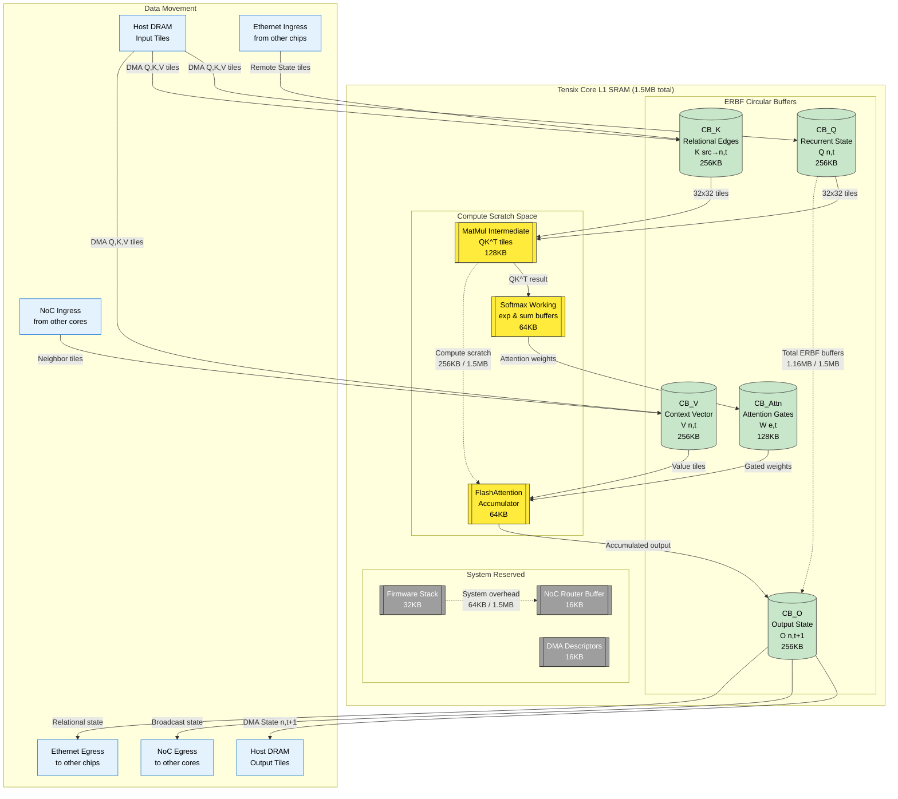

ERBF Circular Buffers (1.16MB):

CB_Q: Recurrent state Q(n,t) - 256KB for current node state
CB_K: Relational edges K(src→n,t) - 256KB for incoming edge data
CB_V: Context vector V(n,t) - 256KB for local context
CB_O: Output state O(n,t+1) - 256KB for next state computation
CB_Attn: Attention gates W(e,t) - 128KB for edge gating weights

Compute Scratch Space (256KB):

MatMul Intermediate: For QK^T computations in attention
Softmax Working: Exp and sum buffers for attention normalization
FlashAttention Accumulator: For efficient attention computation

System Reserved (64KB):

Firmware stack, DMA descriptors, and NoC router buffers

The diagram maps directly to your ERBF operational semantics:

Context injection uses CB_Attn for attention weights
Edge gating applies σ(a[e]) using the attention buffers
Recurrent update flows through CB_Q → compute scratch → CB_O
Belief update aggregates states from CB_O back to host

This efficiently utilizes the 1.5MB L1 SRAM per Tensix core while supporting the distributed cortical computation pattern of ERBF.
