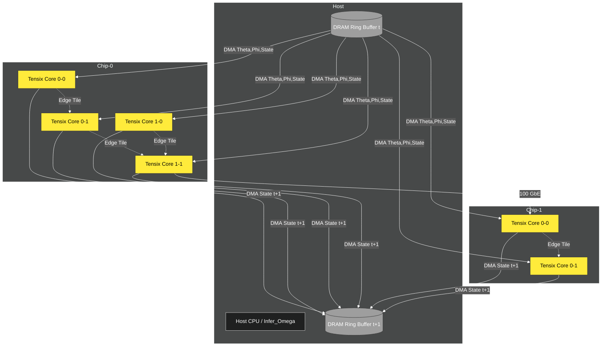

```mermaid
%%{init: {
  'theme': 'dark',
  'themeVariables': {
    'primaryColor': '#ffeb3b',
    'primaryTextColor': '#000',
    'primaryBorderColor': '#333',
    'lineColor': '#fff',
    'textColor': '#fff'
  }
}}%%
graph TD
    subgraph Host["Host"]
        H0[Host CPU / Infer_Omega]
        H1[(DRAM Ring Buffer t)]
        H2[(DRAM Ring Buffer t+1)]
    end

    subgraph Chip0["Chip-0"]
        C00[Tensix Core 0-0]
        C01[Tensix Core 0-1]
        C10[Tensix Core 1-0]
        C11[Tensix Core 1-1]
    end

    subgraph Chip1["Chip-1"]
        D00[Tensix Core 0-0]
        D01[Tensix Core 0-1]
    end

    %% Intra-chip NoC edges
    C00 -.->|Edge Tile| C01
    C01 -.->|Edge Tile| C11
    C10 -.->|Edge Tile| C11

    %% Inter-chip Ethernet edges
    C11 -->|100 GbE| D00
    D00 -.->|Edge Tile| D01

    %% DRAM traffic
    H1 -->|DMA Theta,Phi,State| C00
    H1 -->|DMA Theta,Phi,State| C01
    H1 -->|DMA Theta,Phi,State| C10
    H1 -->|DMA Theta,Phi,State| C11
    H1 -->|DMA Theta,Phi,State| D00
    H1 -->|DMA Theta,Phi,State| D01
    
    C00 -->|DMA State t+1| H2
    C01 -->|DMA State t+1| H2
    C10 -->|DMA State t+1| H2
    C11 -->|DMA State t+1| H2
    D00 -->|DMA State t+1| H2
    D01 -->|DMA State t+1| H2

    %% Define styles for classes
    classDef core fill:#ffeb3b,stroke:#333,color:#000
    classDef dram fill:#9e9e9e,stroke:#333,color:#fff

    %% Apply styles to nodes
    class C00,C01,C10,C11,D00,D01 core
    class H1,H2 dram
```
