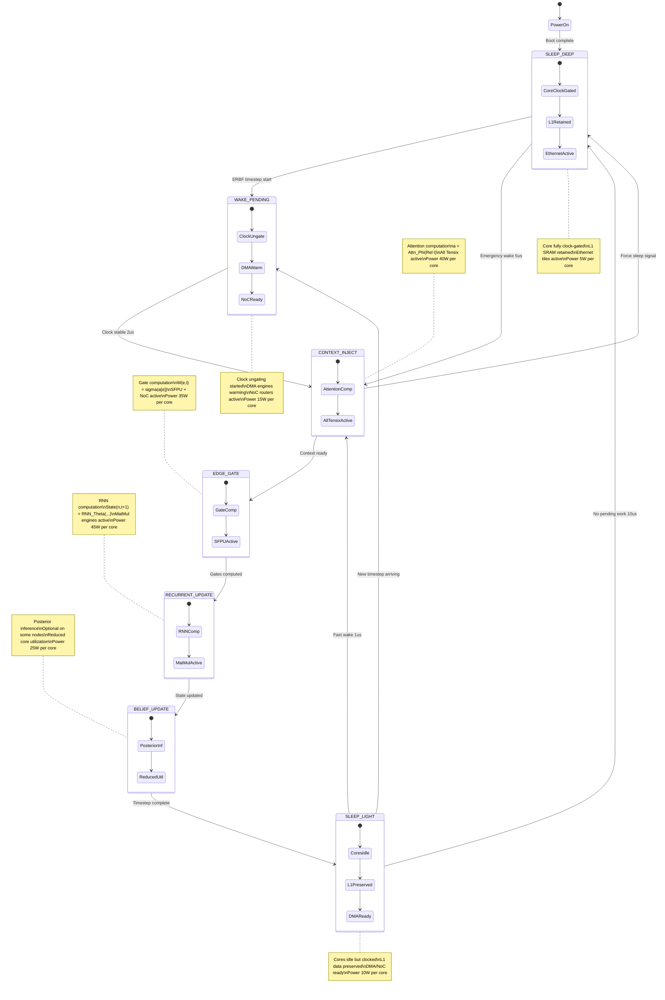

A finite state machine diagram showing how Tensix cores can be clock-gated during ERBF operation to save power while maintaining deterministic latency. Here are the key power states:
Sleep States (Power Saving):

SLEEP_DEEP: Full clock gating (~5W per core) - L1 SRAM retained, only Ethernet tiles active
SLEEP_LIGHT: Cores idle but clocked (~10W per core) - Ready for fast wake-up

Active States (ERBF Computation):

CONTEXT_INJECT: Attention computation (~40W) - Full Tensix utilization for Attn_Φ
EDGE_GATE: Gate computation (~35W) - SFPU active for σ(a[e])
RECURRENT_UPDATE: RNN computation (~45W) - Peak power for matrix operations
BELIEF_UPDATE: Posterior inference (~25W) - Optional, reduced utilization

Transition Management:

WAKE_PENDING: Clock ungating transition (~15W) - 2μs deterministic wake-up

Deterministic Timing:

Cores wake 2μs before each ERBF time-step to ensure zero compute latency
Emergency wake paths for asynchronous events (1-5μs)
Predictable sleep windows between time-steps for maximum power savings

This FSM ensures that ERBF's distributed cortical nodes can operate with deterministic latency while aggressively clock-gating unused cores, potentially reducing power consumption by 70-80% during sparse activation patterns typical in cortical processing.
