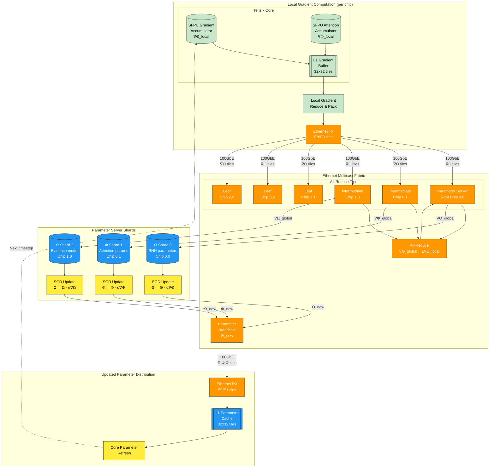

A comprehensive parameter update pipeline diagram showing how ERBF gradients flow through Tenstorrent's multi-chip architecture. The pipeline shows:
Local Gradient Computation:

SFPU accumulators compute ∇Θ and ∇Φ locally on each Tensix core
Gradients are reduced and packed into 32×32 tiles for efficient transport

Ethernet Multicast Fabric:

All-reduce tree topology using 100GbE links between chips
Global gradient aggregation: ∇Θ_global = Σ∇Θ_local across all nodes
Hierarchical reduction minimizes communication overhead

Parameter Server Shards:

Distributed parameter storage across multiple chips:

Θ Shard: RNN core parameters on chip (0,0)
Φ Shard: Attention controller parameters on chip (0,1)
Ω Shard: Evidence model parameters on chip (1,0)

SGD updates applied locally: Θ := Θ - α∇Θ

Updated Parameter Distribution:

New parameters broadcast back through Ethernet fabric
L1 parameter cache updated on each core
Deterministic parameter refresh for next ERBF time-step

This pipeline enables distributed learning across the ERBF cortical network while leveraging Tenstorrent's native Ethernet mesh for efficient gradient aggregation and parameter synchronization.
