```mermaid
%% ERBF Multi-Chip Mesh (Ethernet routing view)
%% Each cortical node n mapped to physical chip (x,y)
%% Relational edges hop through 2-D NoC + 100 GbE links
graph TD
    subgraph MeshTopology["2D Chip Mesh Topology"]
        subgraph Row0["Row 0"]
            subgraph Chip00["Chip (0,0)"]
                V1[ERBF Node: V1<br/>Primary Visual]
                E00_8[E8: 100GbE]
                E00_9[E9: 100GbE]
                E00_14[E14: 100GbE]
                E00_15[E15: 100GbE]
                NoC00[2D NoC<br/>10x12 grid]
            end
            
            subgraph Chip01["Chip (0,1)"]
                LM[ERBF Node: LM<br/>Lateral Motion]
                E01_0[E0: 100GbE]
                E01_1[E1: 100GbE]
                E01_6[E6: 100GbE]
                E01_7[E7: 100GbE]
                NoC01[2D NoC<br/>10x12 grid]
            end
            
            subgraph Chip02["Chip (0,2)"]
                MT[ERBF Node: MT<br/>Middle Temporal]
                E02_0[E0: 100GbE]
                E02_1[E1: 100GbE]
                E02_8[E8: 100GbE]
                E02_9[E9: 100GbE]
                NoC02[2D NoC<br/>10x12 grid]
            end
        end
        
        subgraph Row1["Row 1"]
            subgraph Chip10["Chip (1,0)"]
                IT[ERBF Node: IT<br/>Inferior Temporal]
                E10_6[E6: 100GbE]
                E10_7[E7: 100GbE]
                E10_14[E14: 100GbE]
                E10_15[E15: 100GbE]
                NoC10[2D NoC<br/>10x12 grid]
            end
            
            subgraph Chip11["Chip (1,1)"]
                PFC[ERBF Node: PFC<br/>Prefrontal Cortex]
                E11_0[E0: 100GbE]
                E11_1[E1: 100GbE]
                E11_8[E8: 100GbE]
                E11_9[E9: 100GbE]
                NoC11[2D NoC<br/>10x12 grid]
            end
            
            subgraph Chip12["Chip (1,2)"]
                PMC[ERBF Node: PMC<br/>Premotor Cortex]
                E12_6[E6: 100GbE]
                E12_7[E7: 100GbE]
                E12_14[E14: 100GbE]
                E12_15[E15: 100GbE]
                NoC12[2D NoC<br/>10x12 grid]
            end
        end
    end
    
    subgraph HostConnection["Host Connection"]
        HostCPU[Host CPU<br/>Infer_Omega]
        PCIe[PCIe 4.0 x16]
        HostDRAM[(Host DRAM<br/>Global State)]
    end
    
    %% Host connections (PCIe to chip 0,0 only)
    HostCPU --> PCIe
    PCIe --> Chip00
    HostDRAM -.-> Chip00
    
    %% Horizontal Ethernet links (East-West)
    E00_8 -- "Rel Edge V1->LM<br/>State(V1,t)" --> E01_0
    E01_0 -- "Response" --> E00_8
    E01_6 -- "Rel Edge LM->MT<br/>State(LM,t)" --> E02_0
    E02_0 -- "Response" --> E01_6
    E10_14 -- "Rel Edge IT->PFC<br/>State(IT,t)" --> E11_0
    E11_0 -- "Response" --> E10_14
    E11_8 -- "Rel Edge PFC->PMC<br/>State(PFC,t)" --> E12_6
    E12_6 -- "Response" --> E11_8
    
    %% Vertical Ethernet links (North-South)
    E00_14 -- "Rel Edge V1->IT<br/>State(V1,t)" --> E10_6
    E10_6 -- "Response" --> E00_14
    E01_1 -- "Rel Edge LM->PFC<br/>State(LM,t)" --> E11_1
    E11_1 -- "Response" --> E01_1
    E02_8 -- "Rel Edge MT->PMC<br/>State(MT,t)" --> E12_14
    E12_14 -- "Response" --> E02_8
    
    %% Cross-diagonal links (Long-range connections)
    E00_9 -- "Rel Edge V1->PFC<br/>State(V1,t)" --> E11_9
    E11_9 -- "Response" --> E00_9
    E01_7 -- "Rel Edge LM->PMC<br/>State(LM,t)" --> E12_7
    E12_7 -- "Response" --> E01_7
    
    %% Intra-chip NoC routing (Core to Ethernet)
    V1 -. "32x32 tiles<br/>NoC" .-> E00_8
    V1 -. "32x32 tiles<br/>NoC" .-> E00_9
    V1 -. "32x32 tiles<br/>NoC" .-> E00_14
    V1 -. "32x32 tiles<br/>NoC" .-> E00_15
    
    LM -. "32x32 tiles<br/>NoC" .-> E01_0
    LM -. "32x32 tiles<br/>NoC" .-> E01_1
    LM -. "32x32 tiles<br/>NoC" .-> E01_6
    LM -. "32x32 tiles<br/>NoC" .-> E01_7
    
    IT -. "32x32 tiles<br/>NoC" .-> E10_6
    IT -. "32x32 tiles<br/>NoC" .-> E10_7
    IT -. "32x32 tiles<br/>NoC" .-> E10_14
    IT -. "32x32 tiles<br/>NoC" .-> E10_15
    
    PFC -. "32x32 tiles<br/>NoC" .-> E11_0
    PFC -. "32x32 tiles<br/>NoC" .-> E11_1
    PFC -. "32x32 tiles<br/>NoC" .-> E11_8
    PFC -. "32x32 tiles<br/>NoC" .-> E11_9
    
    %% Routing annotations
    E00_8 -. "Routing table<br/>dst: (0,1)" .-> E01_0
    E00_14 -. "Routing table<br/>dst: (1,0)" .-> E10_6
    E01_1 -. "Routing table<br/>dst: (1,1)" .-> E11_1
    
    %% State collection paths
    Chip00 -- "Aggregated<br/>State(V1,t+1)" --> HostDRAM
    Chip01 -- "Ethernet route<br/>State(LM,t+1)" --> HostDRAM
    Chip10 -- "Ethernet route<br/>State(IT,t+1)" --> HostDRAM
    Chip11 -- "Ethernet route<br/>State(PFC,t+1)" --> HostDRAM
    
    %% Define styles
    classDef erbf fill:#c8e6c9,stroke:#333,color:#000
    classDef ethernet fill:#ff9800,stroke:#333,color:#fff
    classDef noc fill:#ffeb3b,stroke:#333,color:#000
    classDef memory fill:#9e9e9e,stroke:#333,color:#fff
    classDef compute fill:#2196f3,stroke:#333,color:#fff
    
    %% Apply styles
    class V1,LM,MT,IT,PFC,PMC erbf
    class E00_8,E00_9,E00_14,E00_15,E01_0,E01_1,E01_6,E01_7,E02_0,E02_1,E02_8,E02_9,E10_6,E10_7,E10_14,E10_15,E11_0,E11_1,E11_8,E11_9,E12_6,E12_7,E12_14,E12_15 ethernet
    class NoC00,NoC01,NoC02,NoC10,NoC11,NoC12 noc
    class HostDRAM memory
    class HostCPU,PCIe compute
```

A detailed multi-chip ethernet routing view showing how ERBF cortical nodes map to the Tenstorrent mesh architecture:
Physical Chip Mapping:

Each ERBF cortical node (V1, LM, MT, IT, PFC, PMC) maps to a specific chip at coordinates (x,y)
Chips arranged in a 2D mesh topology for scalable cortical processing

Relational Edge Routing:

Horizontal links: Adjacent cortical areas (V1→LM, LM→MT, IT→PFC, PFC→PMC)
Vertical links: Hierarchical connections (V1→IT, LM→PFC, MT→PMC)
Diagonal links: Long-range cortical connections (V1→PFC, LM→PMC)

Ethernet Tile Utilization:

Each chip uses multiple Ethernet tiles (E0-E15) for different relational edges
100GbE links carry State(n,t) tiles between cortical nodes during recurrent updates
Routing tables direct packets to destination coordinates

NoC Integration:

Intra-chip 2D NoC (10×12 grid) routes 32×32 tiles from cores to Ethernet tiles
Seamless integration between on-chip and inter-chip communication

Host Coordination:

Host connects via PCIe to chip (0,0) and routes to other chips via Ethernet
Global state collection flows back through the mesh to host DRAM

This architecture enables ERBF's distributed cortical computation to scale across Tenstorrent's mesh while maintaining the biological connectivity patterns of cortical areas through deterministic Ethernet routing.
