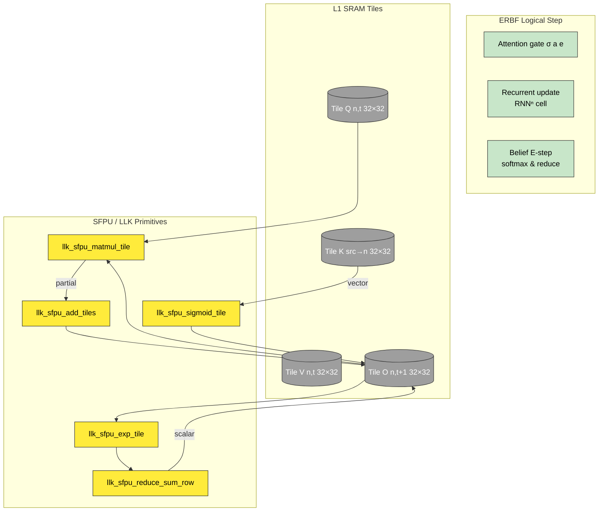

```mermaid
%% ERBF time-step mapped to Tenstorrent SFPU / LLK primitives
%% Green = ERBF logical ops
%% Yellow = LLK vector instructions
%% Grey = L1 tiles & registers
graph TD
    subgraph ERBFLogical["ERBF Logical Step"]
        A[Attention gate σ a e]
        B[Recurrent update<br/>RNNⁿ cell]
        C[Belief E-step<br/>softmax & reduce]
    end
    
    subgraph L1SRAM["L1 SRAM Tiles"]
        TileQ[(Tile Q n,t 32×32)]
        TileK[(Tile K src→n 32×32)]
        TileV[(Tile V n,t 32×32)]
        TileO[(Tile O n,t+1 32×32)]
    end
    
    subgraph SFPULLK["SFPU / LLK Primitives"]
        S1[llk_sfpu_sigmoid_tile]
        S2[llk_sfpu_matmul_tile]
        S3[llk_sfpu_add_tiles]
        S4[llk_sfpu_reduce_sum_row]
        S5[llk_sfpu_exp_tile]
    end
    
    %% Attention gate
    TileK -->|vector| S1
    S1 --> TileO
    
    %% Recurrent update
    TileQ --> S2
    TileO --> S2
    S2 -->|partial| S3
    S3 --> TileO
    
    %% Belief E-step (softmax & reduce)
    TileO --> S5
    S5 --> S4
    S4 -->|scalar| TileO
    
    %% Define styles for classes
    classDef sfpu fill:#ffeb3b,stroke:#333,color:#000
    classDef mem fill:#9e9e9e,stroke:#333,color:#fff
    classDef logical fill:#c8e6c9,stroke:#333,color:#000
    
    %% Apply styles to nodes
    class S1,S2,S3,S4,S5 sfpu
    class TileQ,TileK,TileV,TileO mem
    class A,B,C logical
```
