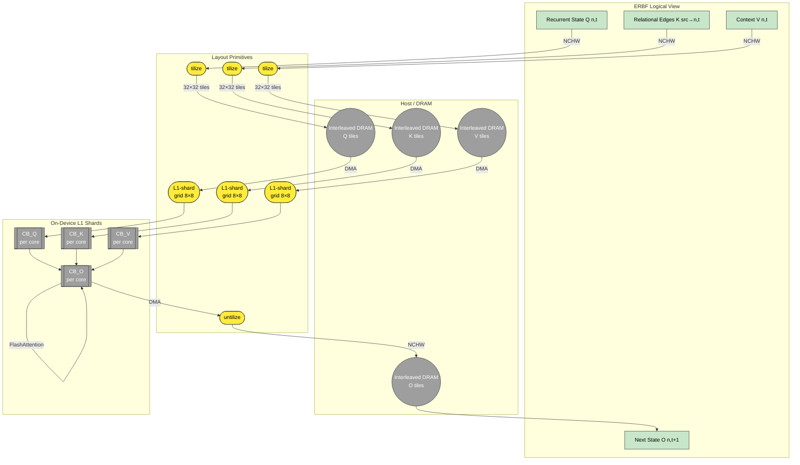

```mermaid
%% ERBF (Enactive Relational Bayesian Filter) mapped to Tenstorrent Tensor-Layout primitives
%% Green boxes = logical ERBF data
%% Yellow boxes = Tensix layout operations
%% Grey cylinders = physical memories
graph TD
    subgraph ERBFLogical["ERBF Logical View"]
        Q[Recurrent State Q n,t]
        K[Relational Edges K src→n,t]
        V[Context V n,t]
        O[Next State O n,t+1]
    end
    
    subgraph HostDRAM["Host / DRAM"]
        DRAM_Q((Interleaved DRAM<br/>Q tiles))
        DRAM_K((Interleaved DRAM<br/>K tiles))
        DRAM_V((Interleaved DRAM<br/>V tiles))
        DRAM_O((Interleaved DRAM<br/>O tiles))
    end
    
    subgraph LayoutPrimitives["Layout Primitives"]
        TilizeQ([tilize])
        TilizeK([tilize])
        TilizeV([tilize])
        ShardQ([L1-shard<br/>grid 8×8])
        ShardK([L1-shard<br/>grid 8×8])
        ShardV([L1-shard<br/>grid 8×8])
        UntilizeO([untilize])
    end
    
    subgraph OnDeviceL1["On-Device L1 Shards"]
        ShardQ_L1[[CB_Q<br/>per core]]
        ShardK_L1[[CB_K<br/>per core]]
        ShardV_L1[[CB_V<br/>per core]]
        ShardO_L1[[CB_O<br/>per core]]
    end
    
    %% Flow connections
    Q -->|NCHW| TilizeQ
    TilizeQ -->|32×32 tiles| DRAM_Q
    K -->|NCHW| TilizeK
    TilizeK -->|32×32 tiles| DRAM_K
    V -->|NCHW| TilizeV
    TilizeV -->|32×32 tiles| DRAM_V
    
    DRAM_Q -->|DMA| ShardQ
    ShardQ --> ShardQ_L1
    DRAM_K -->|DMA| ShardK
    ShardK --> ShardK_L1
    DRAM_V -->|DMA| ShardV
    ShardV --> ShardV_L1
    
    ShardQ_L1 --> ShardO_L1
    ShardK_L1 --> ShardO_L1
    ShardV_L1 --> ShardO_L1
    ShardO_L1 -->|FlashAttention| ShardO_L1
    
    ShardO_L1 -->|DMA| UntilizeO
    UntilizeO -->|NCHW| DRAM_O
    DRAM_O --> O
    
    %% Define styles for classes
    classDef op fill:#ffeb3b,stroke:#333,color:#000
    classDef mem fill:#9e9e9e,stroke:#333,color:#fff
    classDef logical fill:#c8e6c9,stroke:#333,color:#000
    
    %% Apply styles to nodes
    class TilizeQ,TilizeK,TilizeV,ShardQ,ShardK,ShardV,UntilizeO op
    class DRAM_Q,DRAM_K,DRAM_V,DRAM_O,ShardQ_L1,ShardK_L1,ShardV_L1,ShardO_L1 mem
    class Q,K,V,O logical
```
