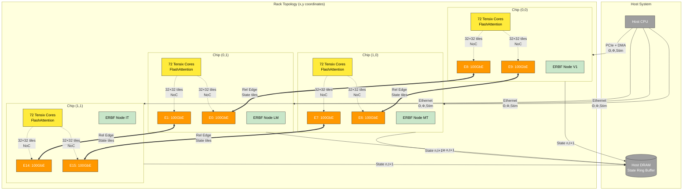

Here are the key design decisions:
Physical Topology Mapping:

Each ERBF cortical node (V1, LM, MT, IT) maps to one Wormhole chip at coordinates (x,y)
Each chip has multiple Ethernet tiles (E0-E15) that can manage 100Gb ethernet Community Highlight: Tenstorrent Wormhole Series Part 1: Physicalities | Tenstorrent
Chips are connected in a 2D mesh through integrated ethernet ports Tenstorrent Wormhole Analysis – A Scale Out Architecture for Machine Learning That Could Put Nvidia On Their Back Foot

ERBF Relational Edge Routing:

Relational edges E ⊆ N × N become physical Ethernet links between chips
E8/E9 tiles on one chip connect to E0/E1 tiles on adjacent chips Community Highlight: Tenstorrent Wormhole Series Part 1: Physicalities | Tenstorrent
State tiles (32×32) flow over these 100GbE links during edge gating and recurrent updates

Data Flow:

Host injects parameters Θ, Φ and stimuli via PCIe/Ethernet
Each chip runs FlashAttention kernels on its 72 Tensix cores
Intra-chip NoC routes 32×32 tiles between cores and Ethernet tiles
State(n,t+1) flows back to host DRAM ring buffer

This mapping allows the ERBF algorithm's distributed cortical computation to leverage Tenstorrent's seamless scale-out capabilities where software sees an infinite mesh of cores without strict hierarchies
