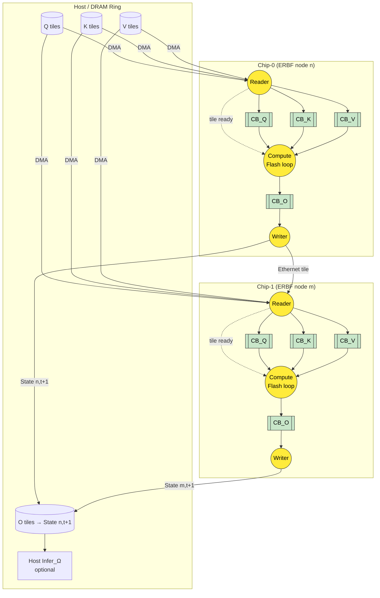

```mermaid
%% ERBF time-step mapped to Tenstorrent FlashAttention flow
%% Each yellow box is a Tensix core running the FA tri-kernel
%% Green boxes are the ERBF-specific stages that reuse the same tile math
%% Arrows = 32×32 tiles / packets over NoC / Ethernet
graph TD
    subgraph Host["Host / DRAM Ring"]
        DRAM_Q[(Q tiles)]
        DRAM_K[(K tiles)]
        DRAM_V[(V tiles)]
        DRAM_O[(O tiles → State n,t+1)]
        HostInfer[Host Infer_Ω<br/>optional]
    end
    
    subgraph Chip0["Chip-0 (ERBF node n)"]
        Reader((Reader))
        CB_Q[[CB_Q]]
        CB_K[[CB_K]]
        CB_V[[CB_V]]
        Compute((Compute<br/>Flash loop))
        CB_O[[CB_O]]
        Writer((Writer))
    end
    
    subgraph Chip1["Chip-1 (ERBF node m)"]
        Reader2((Reader))
        CB_Q2[[CB_Q]]
        CB_K2[[CB_K]]
        CB_V2[[CB_V]]
        Compute2((Compute<br/>Flash loop))
        CB_O2[[CB_O]]
        Writer2((Writer))
    end
    
    %% DRAM → Readers
    DRAM_Q -->|DMA| Reader
    DRAM_K -->|DMA| Reader
    DRAM_V -->|DMA| Reader
    DRAM_Q -->|DMA| Reader2
    DRAM_K -->|DMA| Reader2
    DRAM_V -->|DMA| Reader2
    
    %% Reader → Circuit Buffers
    Reader --> CB_Q
    Reader --> CB_K
    Reader --> CB_V
    Reader2 --> CB_Q2
    Reader2 --> CB_K2
    Reader2 --> CB_V2
    
    %% Intra-chip compute chain
    Reader -.->|tile ready| Compute
    CB_Q --> Compute
    CB_K --> Compute
    CB_V --> Compute
    Compute --> CB_O
    CB_O --> Writer
    
    Reader2 -.->|tile ready| Compute2
    CB_Q2 --> Compute2
    CB_K2 --> Compute2
    CB_V2 --> Compute2
    Compute2 --> CB_O2
    CB_O2 --> Writer2
    
    %% Inter-chip edge communication (ERBF relational edges)
    Writer -->|Ethernet tile| Reader2
    
    %% Write-back to DRAM / next state
    Writer -->|State n,t+1| DRAM_O
    Writer2 -->|State m,t+1| DRAM_O
    DRAM_O --> HostInfer
    
    %% Define styles for classes
    classDef core fill:#ffeb3b,stroke:#333,color:#000
    classDef mem fill:#c8e6c9,stroke:#333,color:#000
    
    %% Apply styles to nodes
    class Reader,Compute,Writer,Reader2,Compute2,Writer2 core
    class CB_Q,CB_K,CB_V,CB_O,CB_Q2,CB_K2,CB_V2,CB_O2 mem
```
